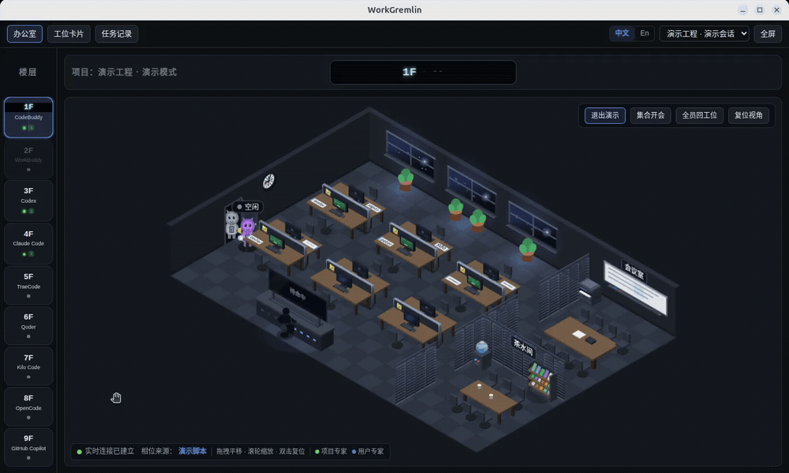

# WorkGremlin

把本机在跑的 AI 编码 agent 变成一间**看得见的办公室**：谁在线、在忙什么、哪一层在干活，一眼扫完。

## 演示视频

<!--
  演示动画放这里。录好之后把文件放进 docs/assets/，再把下面这行的注释去掉即可
  （GitHub 的 README 支持 GIF；要嵌 mp4 就用 <video src="docs/assets/demo.mp4" controls width="720"></video>）
-->
<!--  -->

> 占位：演示动画待录 —— 文件放 `docs/assets/demo.gif`，然后把上面那行取消注释。

## 快速开始

```bash
# 前置：Node >= 24；Linux 另需 python3 + make + g++（编译 better-sqlite3）
node -v && npm -v && python3 --version && which make g++

# 安装依赖（postinstall 会自动跑 electron-rebuild 重建 better-sqlite3）
npm install

# 启动（先起本地服务，再开桌面窗口）
npm run launch

# 想重启服务：npm run launch -- --restart
# 只跑本地服务、不开窗口：npm run server
# 只验一下原生模块能不能用（建表 → 写入 → 读回）：npm run db:check
# 开发模式（Vite 热更 + 窗口）：npm run dev
```

**演示模式**：起完之后，在办公室右下角操作条上点「演示模式」（在「集合开会」左边）——
界面切到一条独立的**演示工程**，主控制台会自动演一轮完整任务，屋里的成员换成演示团队
（6 位专家 + 2 个临时成员）。再点一次「退出演示」就回到进演示前打开的那个工程。

## 三个页面

### 办公室（默认）

一间等距（2.5D）办公室，把"哪个 agent 在干什么"画出来：

- **楼层**：左侧胶囊选层，切换时走**电梯动画**（门关上、门后在换层、门开就是新楼层）；
  每层家具材质配色不同，一眼认得出在哪层。胶囊上的圆点/数字 = 这一层有没有活跃会话、有几条；
  没安装的产品灰显、点不动。门楣上写着当前工程名与楼层。
- **主 Agent 控制台**：悬浮屏上是它当前的相位 ——
  `待命中 / 未上报 / 思考中 / 调用工具 / 委托专家 / 等待授权 / 等待中（等 subagent 汇报）/ 任务完成 / 任务取消`。
  鼠标停在悬浮屏上会弹出操作、目标、技能与上下文；左下角标着这一份相位是**上报真值 / 推断值 / 演示脚本**。
- **小怪物（坐工位的 subagent）**：上班时一个个从大门走进来坐下；被主 Agent 召唤（`task` 工具）时
  跑到控制台**右侧**领任务、答一句"收到"，再回工位干活，干完回控制台汇报结果；
  被召唤期间头顶会出现一只**小幽灵**（这次 subagent 的实例），它从大门飘进来。
  空闲的会去接水、打印、找人聊天；两个以上被阻塞会自己「集合开会」。
- **交互**：拖拽平移 · 滚轮缩放 · 双击复位；点工位弹任务卡；悬停小怪物看当前任务；
  悬停控制台悬浮屏看相位详情；`F` 全屏 / `Esc` 退出全屏。
- **顶栏会话下拉**：选哪一条会话，主控制台就显示**那条会话自己**的相位（多开会话时各显示各的，
  不会串味）；没选就跟着当前楼层。
- 右下角操作条：`演示模式` / `集合开会` / `全员回工位` / `复位视角`。

### 工位卡片

当前楼层每个成员一张卡片（主 Agent 固定第一张）：

- **角色**：主代理 / 项目子代理 / 用户子代理；
- **状态**：只有两档 —— 忙碌 / 空闲（状态点与文案同色，不会出现"绿点 + 空闲"）；
- **当前任务**：正在干的那条；空闲时如实写「空闲」，不会把上一个任务留在卡片上；
- **描述**：子代理定义里写的"它是干什么的"（静态信息，不是状态）；
- **时间**：进行中显示「开始 MM-DD HH:mm」，空闲显示「最近活跃 MM-DD HH:mm」；
- 没接上报的成员标「被动观测」，状态按推断灰显。

只列常住小怪物；临时召唤出来的幽灵不占卡片位（避免"召唤一次，列表里多一只"的误会）。

### 任务记录

上方筛选对三个视图同时生效：

- **工程 / 楼层**（走服务端取数）、**状态 / 时间 / 关键字**（在当前结果上再筛）；
- **时间**有八个档位：全部时间 / 今天 / 昨天 / 过去 7 天 / 过去 30 天 / 这个月 / 上个月 / 自定义
  （自定义露出起止两个日期框）。口径是任务的**开始时刻**，按自然日算。

1. **列表视图** —— 一行一次任务，点开右侧详情：状态、客户端、模型、工程、改动过的文件、
   **词元**（非缓存输入 / 缓存读 / 缓存写 / 输出四项分开写，报不出的楼层显示「—」而不是 0）、
   工具使用次数、产出结果、以及它召唤过的 subagent 明细。可单条删除、按当前筛选「删除筛选结果」，
   也能设置记录的自动保留天数（默认保留最近 90 天，更早的由服务端自动清理）。
2. **汇总报表** —— 第一个页签是**数据总览**：按时间逐条列
   `时间 / 任务 / 客户端 / 模型 / 工程 / 词元 / 时长 / 状态`
   （任务标题只取前 10 个字加省略号，鼠标悬停看全文；点任意一行跳回列表并选中那条任务）。
   另有**按工程 / 按模型 / 按楼层**的聚合表：任务数、成功数、取消数、改动文件数、词元合计、
   总耗时、平均耗时，点行即可下钻到列表。整表可导出 CSV。
3. **图形看板（每日）** —— 一天一张**楼层 × 时间**的甘特图：横轴是当天 00:00–24:00
   （每小时一条竖线），纵轴是楼层（如「3F Codex」），行里的色块就是那一层的一次任务，
   块的颜色对应该任务的状态。同一时间并行跑好几条时，把重叠的那一段**颜色加深**
   （一层恒定一行，不往下摞）；看今天时有一条「此刻」虚线；点块跳到列表里那条任务。
   **能往前/往后翻到哪几天，由上方的时间筛选决定**（不在窗口里的按钮置灰）。
   没任务的日子照样画空表格；筛选是「全部楼层」时，**所有已安装的楼层各占一行**（空的留空格子）。

## 支持的楼层

一层一个受监控的产品（左侧胶囊按这个顺序排），**装了哪个哪层能点**，没装的灰显：

| 楼层 | 产品 | 形态 |
| --- | --- | --- |
| 1F | CodeBuddy | CLI（终端）与 IDE 插件，合并成一层 |
| 2F | WorkBuddy | CLI |
| 3F | Codex | CLI 与 IDE 插件（同一份落盘，合并成一层） |
| 4F | Claude Code | CLI 与 IDE 插件（同一份落盘，合并成一层） |
| 5F | TraeCode | IDE 本体与插件 |
| 6F | Qoder | CLI 与插件（同一份落盘，合并成一层） |
| 7F | Kilo Code | 终端 TUI 与 VS Code 扩展 |
| 8F | OpenCode | CLI / TUI / 桌面端 / 网页端（同一份数据） |
| 9F | GitHub Copilot | VS Code 插件 |

## 它显示什么、不显示什么

- **只画真值**：状态、任务、文件、耗时都来自 agent 自己上报或它本地的落盘；拿不到就写
  「未上报 / —」，不替你编一个数字。
- **没有假进度**：进度条已经去掉 —— 拿不到能逐轮推进的真实进度时，画出来只会骗人。
- **状态两档**：忙碌 / 空闲（办公室名牌与卡片同一套口径）；更细的相位只在主控制台那一屏上写。
- **心跳断了就灰**：超过 60s 没有心跳的成员标成 degraded（推断值），界面灰显并标注。

## 数据与配置

- 数据都在 `~/.workgremlin/`：`workgremlin.db`（一个 SQLite 库）+ 各产品的状态文件。
  换目录用 `WORKGREMLIN_HOME`，换库文件用 `WORKGREMLIN_DB`。
- 启动时会**自动把"状态上报 hook"写进已装产品的配置**（只加/更新我们自己的条目，
  改动前备份成 `.bak-workgremlin`）。不想被自动改配置：`WORKGREMLIN_NO_AUTO_HOOKS=1`。
- 打开工程：服务启动时定 —— `WORKGREMLIN_WORKSPACE=<目录>`（或
  `npm run server -- --workspace <目录>`），都没给就用启动时所在目录；
  上次打开过哪个工程会记住，下次启动自动恢复。

## 文档

| 想看什么 | 看哪份 |
| --- | --- |
| 产品要什么、验收标准 | `docs/requirements.md` |
| 代码实际怎么做的、与文档哪里对不上 | `docs/implementation-status.md` |
| 技术选型与数据结构 | `docs/tech-design.md` |
| 跑起来 / 排障 | `docs/runbook.md` |
