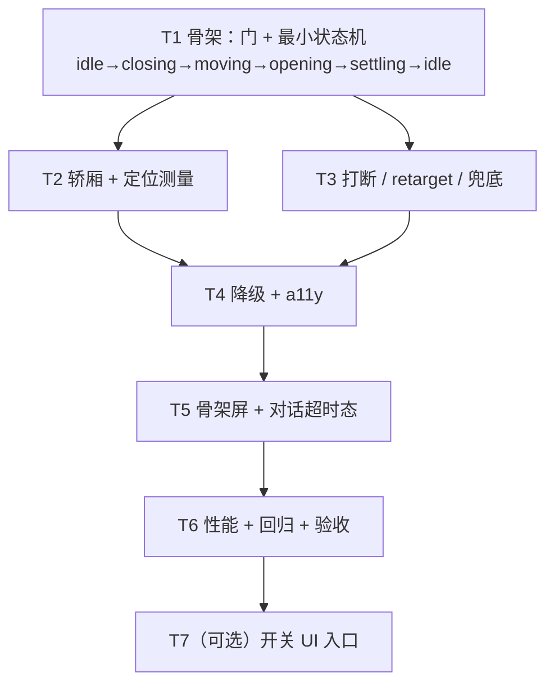

# 楼层切换电梯动画 —— 实现难度与工作量评估（复核 design-elevator-transition.md）

> 本文只做**成本复核与分工**，不改设计、不改业务代码。
> 复核基准：`docs/design-elevator-transition.md` v0.1（390 行，§6.2 估 5 文件 / 250–330 行）。
> 复核方式：读设计全文 + 实读 `App.vue`（187 行）、`FloorSelector.vue`（209 行）、`theme.css`（87 行）、`stores/sessions.js` 关键段，并枚举 `renderer/src` 下全部 22 个 `.vue` / 14 个 `.js`。

---

## 1. 结论先行

| 项 | 结论 |
| --- | --- |
| **整体难度** | **中**（不是低）。不碰 `iso/engine.js`（85KB）、不碰后端、不碰 Pinia store 主逻辑 —— 这三点是"低"的支撑；但有一个**真状态机 + 异步竞态 + 布局测量 + 双份降级路径**，"中偏高"是上限。 |
| **预估工作量** | **18–26 人时**（约 2.5–3.5 人日），中位数 **22 人时**。含自测与联调，不含需求返工与设计评审。 |
| **代码量** | **470–590 行**（设计估 250–330 行），差 **+220~260 行，约 1.7–1.8 倍**。 |
| **与 §6.2 是否一致** | **不一致，但§6.2 的"文件清单"基本对、"行数"系统性低估**。差异不是设计写错了，而是**设计正文（§2 时序 / §3.3 超时 / §4.3 打断 / §5.1 三档开关）里承诺的行为，没有全部折算进 §6.2 的表**。详见 §1.1。 |
| **最大发现** | 设计漏了 **1 个必须动的文件**（对话区加载/失败态载体）和 **1 个必须定义的接口**（"待定目标层"高亮，见 §2.3），以及 **1 个不存在的前提**（"设置里手动关"——**仓库里没有设置 UI**）。 |

### 1.1 与设计 §6.2 的差额逐项对账

| 差额来源 | 设计里写在哪 | §6.2 是否折算 | 补量 |
| --- | --- | --- | --- |
| `moving` 中改目的层需 **"先到最近可达层再折返"**（retarget + 反向二次 moving） | §4.2 / §4.3 | ❌ 未折算 | +35~50 行 |
| 5 段各挂一个 **2s 兜底 timeout** + 窗口失焦 / `onUnmounted` 强制落 `idle` | §3.3 / §8.1 | ❌ 未折算 | +20~30 行 |
| 中间层掠过需**按 `ease⁻¹` 预计算一串 setTimeout** | §7.1 | ❌ 未折算 | +15~20 行 |
| **三档 motion 开关**（localStorage + `matchMedia` + 三档归并 + `request()` 短路） | §5.1 | ❌ 未折算 | +15~20 行 |
| **"待定目标层"高亮接口**（t=0 就要点亮目的层胶囊，但 `selectFloor` 要到 t=185ms 才提交） | §2 段0（隐含） | ❌ 未折算 | +30~40 行（FloorSelector） |
| **对话区超时 / 失败态**（1500ms abort + "加载中…" + 失败重试） | §3.3 | ❌ 未折算，且点名"store 不动" | +35~50 行（App.vue + 对话视图） |
| `theme.css` motion token | §5.1 | ✅ 已折算 | +0 |

一句话：**§6.2 的数是基于"动画主体"估的，没算"打断/兜底/降级/数据态"这四条尾巴。** 这四条尾巴恰好是这套方案里最容易出 bug 的部分，代码密度也最高（不是样式行，是逻辑行）。

### 1.2 复核确认"确实不用动"的部分（给实现方省时间）

- `renderer/src/stores/sessions.js` —— 确认 `selectFloor()` 是纯同步三行赋值（`sessions.js:185-191`），无请求。**store 不用改**，设计的判断成立。
- `renderer/src/iso/engine.js`（85KB）—— 不动。设计说的 "paused 开关先不做" 我同意，等实测。
- `renderer/src/main.js` —— 不动，`theme.css` 已在 `main.js:4` 全局引入，新增 token 直接生效。
- 后端 / 协议 —— 零改动。

---

## 2. 逐文件改动清单

> 图例：✅=设计已点名；🆕=**设计没点名但复核发现必须动**；⚪=可选。

| # | 文件 | 动作 | 新增行数 | 难度 | 踩坑点 |
| --- | --- | --- | --- | --- | --- |
| 1 | `renderer/src/composables/useElevator.js` | 🆕 **新建文件 + 新建 `composables/` 目录**（仓库现有 14 个 `.js`，**无 `composables/` 目录**，这是首个） | **170–200** | **高** | ① `retarget`（moving 中换目标→先到最近可达层→折返）是最难的一段，本质是"动画中途改终点的路径重规划"；② 5 段兜底 timeout 与正常 `sleep` 会互相触发，必须统一走 token 校验；③ `ease⁻¹` 反函数不写精确解（cubic-bezier 求根），近似线性查表即可，别过度工程；④ 模块级单例 + `ref`，App.vue 与 FloorSelector 都要读，注意别在 SSR/多实例下误用（本项目无 SSR，OK） |
| 2 | `renderer/src/components/ElevatorDoors.vue` | 🆕 新建：两扇 `.door-l/.door-r` + `<slot>` 包主舞台 + CSS 版骨架屏 | **110–130** | **中** | ① 门必须 `pointer-events:none` + `aria-hidden`；② `will-change` 只在动画期挂、进 `idle` 摘 —— 摘的时机由 `phase` 驱动，别用 `transitionend`（会丢事件）；③ 骨架屏是 `<slot>` 之上的**兄弟层**，不能塞进 slot 里（会盖住 Canvas 还要手动恢复 z-index）；④ 门初始 `translateX(±100%)` 要写在 `idle` 态，否则首帧会闪一下全屏门 |
| 3 | `renderer/src/components/FloorSelector.vue` | ✅ 改：`.rail` 加 `position:relative`、加 `.car` 覆盖层 + odometer 数字条、中间层 `.pass` 伪元素、`aria-*`、`offsetTop` 测量 + `ResizeObserver` | **115–145** | **中高** | ① ⚠️ **`.rail` 现有 `overflow-y:auto`（`FloorSelector.vue:92`）**：绝对定位的 `.car` 会随内容滚动（行为正确），但若楼层多到 rail 真滚动，轿厢会滚出可视区；且 `overflow` 会裁剪外发光。先按"5 层不滚动"做，T6 测 600px 高窗口。**这是设计完全没提的**；② ⚠️ **未安装层是 `:disabled`**（`FloorSelector.vue:67`），状态机必须拒绝不可达目标，否则电梯去一个点不动的层；③ 现有 `.floor` 已有 `transition: transform .1s`（`:116`），轿厢/胶囊的 transform 会打架，要收窄选择器；④ odometer 数字条与轿厢共用 transition，步长必须同源，否则数字和轿厢会脱节 |
| 4 | `renderer/src/App.vue` | ✅ 改：`<section class="stage">` 包 `ElevatorDoors`、`@update:model-value` 改接 `elevator.request()`、根挂 `data-motion`、`role="status"` live region、**`refreshMessages` 加 `AbortController` + 1500ms timeout + loading 态** | **35–50** | **中** | ① 设计估 15 行只算了前三项，**后两项（`refreshMessages` 改造 + live region）是§3.3 承诺的行为，必须做**；② `data-motion` 必须挂在 **`.app`（App.vue 根）** 上，因为它要同时罩住左栏 `FloorSelector` 和主舞台 `ElevatorDoors` —— 挂 `.body` 也行，挂 `.stage` 就罩不到左栏，**这个位置只能选一次，选错后面要返工**；③ `refreshMessages` 现在 `catch` 里是空注释（`:42-44`），加 timeout 后要区分"超时/失败/成功"三态 |
| 5 | `renderer/src/styles/theme.css` | ✅ 改：motion token + `@media (prefers-reduced-motion)` + `[data-motion='off']` 清零 | **20–30** | **低** | ① 与设计一致，可直接照抄 §5.1；② ⚠️ **仓库已有 4 处 `prefers-reduced-motion`**（`DeskScene.vue:697`、`ChatPanel.vue:285`、`GremlinSprite.vue:291`、`GhostSprite.vue:236`）—— 设计 §0.3 说"全仓无"**只对 theme.css 成立**，组件里已有先例。新增的全局 token 不影响它们，但**风格要对齐，别另起一套写法**；③ `[data-motion='off']` 是全局选择器，能命中 scoped 组件内部元素（scoped 只加属性不阻断全局选择器），OK |
| 6 🆕 | `renderer/src/views/ConversationView.vue`（1.57KB，**未实读**）或 `renderer/src/stores/messages.js` | 🆕 承载"对话加载中…" / "加载失败 + 重试按钮"。**设计 §3.3 承诺了这个行为，但 §6.2 表里的"store / 各 view → 不动"把它漏掉了** | **20–35** | **低-中** | ① 二选一：改 `messages.js` 加 `loading/failed`（改动面大、会牵动其它消费方）vs 只在 `ConversationView.vue` 内部自持状态（**推荐后者，改动封闭**）；② 重试按钮要复用现有 `refreshMessages`，别复制一份 fetch 逻辑；③ 这个文件的具体形态**动手前要先读一遍再定**（我未实读，不给臆造结论） |
| 7 ⚪ | 开关 UI 入口（建议放 `App.vue` 的 `.tabs` 里一个按钮，或 `ConnectionBar.vue`） | ⚪ 可选：三档开关的手动入口 | **30–60** | **低** | ⚠️ **仓库里没有设置页/设置组件**（22 个 `.vue` 中无 `Settings*`），且 **`renderer` 下没有任何 `localStorage` 调用** —— 设计 §5.1 的"设置里手动关"目前**无落点**。建议：T4 阶段先只做 `localStorage['wg.elevatorMotion']` 读写（手动改控制台即可验证），**UI 入口不做**，避免为一个开关新开一套设置页 |
| 8 🆕 | `renderer/src/components/FloorLcd.vue` | 🆕 新建：**电梯门上方门楣**的楼层显示屏（层站指示器）。**v0.2 增量，见 §2.4** | **~210**（含注释与 style） | **低-中** | ① 数字滚动必须与轿厢**同一条曲线 + 同一个 moveMs**，否则会出现"数字到了、轿厢没到"；② 一位数字的格子高统一由 `--lcd-slot` 给，JS 只写 `calc(下标 × --lcd-slot)`，别在 JS 里再抄一份 px；③ 滚动同样**只动 `transform`**（屏的窗口高是静态的，不靠 `height` 动画）；④ 未安装层不得出现在目的层位（靠 `request()` 的 installed 校验，屏里只做压暗）；⑤ 挂在 `ElevatorDoors` 的 `.lintel`（门楣）里，**门扇只能盖住 `.portal`（门洞）** —— 门扇若还从 `top:0` 铺满整块，关门时会把屏一起盖掉 |
| 9 🆕 | `renderer/src/lib/elevatorChime.js` | 🆕 新建：到层提示音（WebAudio 现场合成的那声"叮"）。**v0.2 增量，见 §2.4** | **~85**（含注释） | **低** | ① `AudioContext` 必须**懒建**（浏览器/Electron 都要求用户手势之后才出声），呼梯本身是点击，所以第一次要响时再建；② 触发点是 `phase` 进 `opening`（门开始开）**那一刻**，不能在 `moving` 结束前抢先响（会"还没到就响"）；③ 只在"进入 opening"时响一次，`settling`/`idle` 不重复响；④ 零动画档（`off`）下 `phase` 从不离开 `idle`，**天然不会响** —— 这是刻意的（那个档的语义就是"别演"），别为它单独补一条播放路径 |

**合计**：必须做的 6 个文件 **470–590 行**；加上可选第 7 项 **500–650 行**；液晶屏（第 8 项）为 v0.2 增量 **+~210 行**，不含在上面 18–26 人时的估算里。
**新建目录**：`renderer/src/composables/`（1 个）。

### 2.3 设计漏掉的那个接口："待定目标层"高亮

这是本次复核**最需要设计方补一句**的地方：

- §2 段 0（t=0–60ms）要求"目的层胶囊边框转 accent + 外发光点亮"；
- 但 §2 段 1 明确 `sessions.selectFloor(target)` 要到 **t≈185ms（关门 70%）** 才提交；
- 而 `FloorSelector` 的高亮由 `:class="{ selected: p.id === modelValue }"` 驱动，`modelValue` = `sessions.selectedFloor`（`App.vue:126`）。

→ **t=0~185ms 之间高亮无处可去**。必须新增一条通路让 `FloorSelector` 拿到"待定目标层"：

| 方案 | 代价 | 建议 |
| --- | --- | --- |
| A. `FloorSelector` 直接 `import { useElevator }`（模块级单例） | 0 个新 prop，但组件与单例强耦合，不可复用 | 接受，本项目只有一个左栏 |
| B. App.vue 传新 prop `pendingFloor` | +1 prop，组件保持纯净 | 若要写测试就选这个 |
| C. 不改，把 selectFloor 提前到 t=0 | **否决** —— 换脸就没门挡了，违背设计主旨 | — |

**建议 A**（与设计 §7.2 "模块级单例"的既定路线一致），并在 `useElevator` 里导出一个 `displayFloor = phase === 'idle' ? currentFloor : targetFloor`，让 `FloorSelector` 的高亮和轿厢位置**共用一个来源**，避免"高亮在 4F、轿厢在 3F"的错位。

---

### 2.4 楼层显示屏（`FloorLcd.vue` + `elevatorChime.js`）：位置、phase 映射、token 清单

> 现状：设计 §1 / §2 里提过"轿厢内 odometer 数字条"，但一直没落地（T2 只交付了轿厢位移与高亮）。
> 本次把"回答现在在哪层 / 要去哪层"这件事补上，**形态从"轿厢内数字条"改成"电梯门上方门楣上的固定显示屏"**。

**位置选择：门楣（`ElevatorDoors` 的 `.lintel`）—— 电梯门正上方、居中。** 两块理由：

| 理由 | 说明 |
| --- | --- |
| 要像真电梯 | 真实电梯里那块屏就装在**门套 / 门楣**上，门开合它都在（这正是产品负责人点名要的）：看屏 = 看这部电梯，而不是去左栏井道里找数字。第一版放在井道顶部，语义没错但"不像电梯" |
| 装不下 / 会互相打架 | 轿厢那格只有 140px 宽、一个层高，塞不下「当前层 + 目的层 + 方向」三样；而屏若跟着 `carFloor` 在井道里滑，**数字自己也在动**，等于一个屏里叠两层动画（轿厢位移 + 数字滚动），观感是"抖"而不是"快"。放门楣上则又宽又固定 |

结构上的关键一步：`ElevatorDoors` 从"一层（舞台 + 两扇门）"改成**两段**——
`.lintel`（门楣，固定不参与动画）+ `.portal`（门洞，舞台内容 + 两扇门扇）。
门扇只能盖住 `.portal`，所以关门 / 运行途中**屏不会被门扇压住**（真电梯也是这个关系）。
连带影响：`FloorSelector` 不再挂屏（改成只管道 + 轿厢），楼层表由 `App.vue` 传给 `ElevatorDoors`。

形态上与现有基调一致：暗底（`--lcd-bg`，比 `--bg` 更黑）+ 等宽字（`--mono`）+ 发光文字 + **静态**扫描线（`repeating-linear-gradient`，不参与动画）+ `--radius` 圆角 + `--border-strong` 边框，颜色取 accent 同族的青蓝。零图片、零依赖。

**门楣自己的体面（v0.3 调整）**：门楣**不是**"贴着窗口顶边的一条异色横条"，而是和下面办公室画布**同色、同框、同圆角**的同一块板 ——
底色改用 `--iso-bg`（与 `IsoOfficeView` 的 `.scene-wrap` 共用同一个 token，两处不许各写一份，否则迟早会飘），
外面一圈 `--border` + `--radius` 圆角，再留 12px 外边距（`margin` 与 `.stage` 的 `padding` 同值，
于是门楣与画布的左右边落在同一条竖线上）。全屏模式下画布去掉边框/圆角，门楣同步去掉（见 `App.vue` 的 `.app.fullscreen`）。
这样"屏"看上去是装在那块板上、而不是浮在一条横条里；屋子里看到的顶带与画布连成一片。

滚动条：整屏就是一条纵向数字带（5 个层号），窗口只露一格，`transform: translateY(-下标 × --lcd-slot)` —— 就是设计 §7.1 说的 odometer，只是从轿厢挪到了屏里。**位移曲线与轿厢共用 `--ease-shaft-move`，时长共用内联的 `moveMs`**，所以"数字跳格"和"轿厢滑行"是同一个时钟，不需要另开 rAF / setTimeout 去对表（设计 §7.1 里那串 `ease⁻¹` 预计算因此**不需要了**）。

**phase → 显示 映射表**（唯一真相源是 `useElevator`，屏里不存状态）：

| phase | 大数字（滚动带） | 目的层位 | 箭头 | 说得通在哪 |
| --- | --- | --- | --- | --- |
| `idle` | 当前层，定格 | 暗段 `--` | 暗点 `•` | 停着就必须稳稳答"在哪层"；没有目标就不亮目的层（真电梯停靠时目的地指示也是灭的） |
| `closing` | 出发层（不动） | 目的层点亮 | `▲` / `▼` | 关门期间轿厢还没起步（`carFloor` = `fromFloor`），但屏上已经在答"要去哪" —— 与 t=0 点亮目的层胶囊是同一时刻 |
| `moving` | 出发层 → 目的层 逐格滚过 | 目的层点亮 | `▲` / `▼` | 数字带与轿厢同曲线同时长，路上掠过的层（含未安装层，压暗）会从窗口里扫过 |
| `opening` | 目的层，定格 | 熄灭 | 暗点 | 到站：目的层没有意义了 → 熄灭并定格，"现在在哪层"由大数字回答 |
| `settling` | 同 `opening` | 熄灭 | 暗点 | 同上（内容就位期间屏不再变） |
| `off` 档 / 系统减弱动态效果 | 新层，直接跳（不动画） | — | — | `phase` 从不离开 `idle`，屏显示的仍是 `currentFloor` → 换层后照样正确，**不会因为"从没进过 moving"而显示错楼层** |

为此在 `useElevator.js` 里加了**两个派生导出**（按 §2.3 方案 A 的路线：单一来源，组件不自己判 phase 组合）：

| 导出 | 值 | 为什么不在组件里算 |
| --- | --- | --- |
| `pendingFloor` | `closing` / `moving` 时 = `targetFloor`，其余 `''` | "要不要显示目的层"是动画语义（到站即灭），散在组件里会和其它消费方的判断走偏 |
| `direction` | `closing` / `moving` 时 `'up'` / `'down'`，其余 `''` | 需要**楼层顺序**才能判方向，而层表只有 store 有；在组件里判就是"再排一套顺序"。另外判的是 `fromFloor → targetFloor`，不能判 `carFloor → targetFloor`（`moving` 时 `carFloor` 已等于 `target`，判出来永远是空） |

两者共用内部一个 `facing`（是不是还在"没到站"的段）闸门 —— 这样"到站后箭头还指着上"这类不一致不会出现（自查时确实抓到过一次）。

**新增 token 清单**（全部加在 `theme.css`）：

| token | 值 | 用途 |
| --- | --- | --- |
| `--lcd-bg` | `#05070a` | 屏底（比 `--bg` 更黑，才像"背光屏"） |
| `--lcd-lit` | `#7fe6ff` | 点亮的段码 / 发光（与 `--accent` 同族的青蓝） |
| `--lcd-dim` | `#33414d` | 未点亮的段、暗点、未安装层 |
| `--lcd-slot` | `26px` | **一位数字的格子高**：滚动位移 = `calc(-1 × 下标 × --lcd-slot)`，改字号只改这一处 |
| `--dur-lcd-fade` | `140ms` | 目的层数字与箭头的点亮/熄灭 |
| `--ease-lcd-fade` | `cubic-bezier(0.2, 0, 0.2, 1)` | 同上 |

两条降级路径都按现有写法补齐（照抄 `.door` / `.car` 的既有做法）：

- `@media (prefers-reduced-motion: reduce)`：`--dur-lcd-fade: 0ms`，并把 `.lcd-odo` 加进 `transition: none !important` 名单（它的时长是内联的，光归零 token 盖不住）；
- `[data-motion='off']`：`.lcd-odo` 加进 `transition-duration: 0ms !important` 名单；屏的点亮/熄灭**只吃 token**、没有内联时长，所以那里单独归零 `--dur-lcd-fade` 就够，不用再点名元素。

**到层提示音（`lib/elevatorChime.js`）：**

| 项 | 做法 |
| --- | --- |
| 触发点 | `ElevatorDoors` 里 `watch(phase)`，**进入 `opening`** 那一刻响（门开始开）；`settling` / `idle` 不重复响 |
| 音色 | WebAudio 现场合成**金属钟**（不是"两个正弦叠加"——那样听感是电子提示音）。三件事缺一不可：① **非谐泛音** `1 / 2.0 / 2.76 / 4.07 / 5.43`（整数倍叠加 = 风琴音，非谐才是金属）；② 开头 20ms 的**敲击噪声**（2.5kHz 高通、线性衰减）给"金属被敲到"那一下；③ 各泛音**衰减不同**（高频 0.2s 就没、基音拖 1.05s），于是是"叮——"而不是"哔"。每次响再加 ±0.2% 随机失谐，连按不会两声一模一样 |
| 峰值 | 泛音幅度和 2.13 × 总线增益 `0.12` ≈ 0.26（约 -12 dBFS）：留足余量不削顶，也不会盖住环境音量 |
| 备选音色 | `localStorage['wg.elevatorChime']`：`bell`（默认，单声钟）/ `chime`（两音门铃 E6→C6 下行，老客梯那种"叮-咚"）/ `off`（静音）。改完立刻生效，不用刷新 |
| 为什么不用音频文件 | 零资源零依赖；且音频文件要解码，第一趟常常来不及响、或者响在门开完以后 —— 现场合成与 `opening` 同帧 |
| 懒建 `AudioContext` | 浏览器 / Electron 都要求"用户手势之后"才允许出声，而呼梯本身就是点击，所以第一次要响时再建，`suspended` 时顺手 `resume()` |
| 去重 | 250ms 内的重复触发只响一次（连点楼层不会变成一串铃） |
| 零动画档 | `off` 档 / 系统减弱动态效果下 `phase` 从不离开 `idle` → **不会响**。刻意的：那个档的语义就是"别演"，不额外补播放路径 |

**取舍与遗留**：

- **不做**"中间层掠过"（设计 §2 段 2 的 `.pass` 伪元素闪烁）—— 那是另一块预算，本次只在滚动带里把途经层**压暗**扫过，不逐个高亮。
- **不做**"数字逐个停在中间层"的观感（要按 `ease⁻¹` 预计算一串 `setTimeout`，即设计 §7.1 预留的那套）。现在数字是被窗口裁着**连续扫过**的，观感上更像真电梯的段码屏在跳字，成本是 0 行 JS。
- 屏挂在门楣上（不在井道里），于是"井道滚动时屏滚走 / 屏盖住胶囊"这类问题**整类消失** —— 这也是换成门楣位置的附带收益。代价是主舞台高度少了门楣那一条（约 44px），办公室画布按容器尺寸自适应，不需要额外处理。
- 未安装（置灰）层在屏上**照样显示但压暗**：它们物理上就在井道里，轿厢也会经过；"不可到达"由**目的层位永远不可能是置灰层**来表达（`request()` 入口的 `installed` 校验已经堵住，屏这边只负责不说谎）。
- 屏里给 AT 留了一句 `role="status"` 的隐形文案（"当前 4F，将前往 5F" / "正在前往 5F" / "当前 4F"）；段码带本身 `aria-hidden`（否则读屏会把 5 个层号全念一遍，是噪音）。文案只在段切换时变一次（数字滚动是 `transform`，DOM 文本不变），不会刷屏。
- 遗留：`FloorSelector` 的 `.rail` 滚动 + 轿厢补偿（`rail.scrollTop`）仍是 §4 里那条未接线的已知风险，与本次无关（`.car` 仍可能滚出可视区，屏不会）。

---

### 2.5 T3 落地笔记（打断 / retarget / 兜底）

设计 §4.3 那张策略表已全部实现，推进入口统一收敛到 `step()`（内部判 token + 挂 2s 兜底），
散着写 `await sleep` 再各自判 token 的写法全部收掉 —— 否则加打断逻辑时漏一处就是"上一趟的门开到一半、下一趟又关上"。

落地时有两处**偏离设计原文**，都在代码注释里写了理由：

| 偏离 | 设计原文 | 实际做法 | 为什么 |
| --- | --- | --- | --- |
| 不做 250ms 同层去重 | §4.3「250ms 内重复点同一层 → 忽略」 | 不去重 | ① **不需要**：`startRun` 同步把 phase 切到 `closing`，第二次点击落在 `closing` 分支、目标相同 → 天然幂等（单测 [4] 钉住）；② **有害**：去重要记"上次点的层 + 时刻"，而「点 4F → 50ms 后点 1F 反悔 → 100ms 后再点 4F」会落在窗口内被吞掉，用户觉得"按了没反应" |
| 隐藏页收尾是"走完"而不是"取消" | §8.1「窗口失焦时强制落 `idle`」 | 只在 `document.hidden`（最小化/切走）时把在途那一趟**走完**（该换的层换掉）再回 idle；**不监听 `blur`** | ① `blur` 不触发定时器节流，点一下别的窗口就把动画掐掉太粗暴；② 静默取消会变成"点了没反应"，而用户点了就该去 |

另外补了设计里没写、但实现时证明必需的一步：**折返那一趟也要换脸**。
`selectFloor` 原本只在关门 70% 处提交一次，运行中改目的层后车会开到新目标，
但 store 还停在旧目标 —— 单测 [7] 当场抓到（车到 5F、内容还是 3F）。
现在在折返结束、开门之前补一次提交（门全程关着，突变仍然藏在门后）。

单测：`npm run test:elevator`（49 条断言，覆盖上面这张表的每一行 + 兜底 + off 档 + 强制收尾）。
用注入时钟驱动，不起组件、不起 Electron；`docs/test-strategy.md` 的 L1 规划是 Vitest，等它落地把文件迁过去即可。

---

### 2.6 细节动效（设计 §2 段1b / 段4、§5.1 降级档）

三处补齐，都只碰 CSS + 一个开关，不动状态机的段结构：

| 设计条目 | 落地 | 关键取舍 |
| --- | --- | --- |
| §2 段1b 门锁扣 40ms 脉冲 | `.rail[data-phase='closing'] .car::after` 上的 keyframes：`animation: car-lock 40ms linear var(--dur-door-close) 1` —— 用 `animation-delay` 顶到关门结束那一刻，`0.5 → 1 → 0.55` | ① 门缝线在关门过程中从 `0.35` 亮到 `0.5`（`transition`），脉冲由 animation 接管，两者不打架；② **脉冲的停用判 `data-motion` 而不是 `@media (prefers-reduced-motion)`** —— 用户显式设 `on` 时要能盖过系统偏好（§5.1 的 on 档语义），媒体查询判不了这件事 |
| §2 段4 内容 `opacity/scale` 归位 | 内容外面包一层 `.stage-wrap`：`moving` 段 `opacity:0 + scale(.985)`（`transition: none`），门一开始开就 120ms 归位 | ① **隐藏状态放在 `moving` 而不是 `closing`**：关门第一帧门还全开着，那一刻把内容藏起来会"闪一下"；`moving` 全程门是关的，藏了也看不见；② **藏内容、不藏整个舞台**：门打开时不能让人看见一块空白板；③ 顺带解决了"直接给 slot 内容的根元素写样式会落到子组件上"的问题（中间这层归本组件所有，不用 `:deep`） |
| §5.1 降级档 60ms 淡入淡出 | `auto + prefers-reduced-motion` 归一成 **`reduced`**（新增 `motionMode` 第三档）→ 40ms 淡出 → 换脸 → 40ms 淡入（总 80ms < 100ms）；`data-flash` 驱动，时长走新 token `--dur-flash`（= `useElevator` 的 `FLASH_MS`） | **不能直接把降级当 `off`**：那只偏好说的是"少动"，不是"没有反馈"，硬切是另一种难看。现在 `off` 只在用户明确关掉动画时出现（真·零动画），系统偏好走 `reduced` |

**没做的一项**：设计还提了"HUD / 楼层标签 / 主控制台依次淡入（stagger 30ms）"。这三样东西现在都不在舞台上：
楼层标签已删（层号由门楣屏负责）、主控制台是 canvas 内绘、HUD 只剩顶栏那两个一直可见的元素。
没有可 stagger 的 DOM，硬凑就得给 canvas 内部元素凭空造类名（还要跨组件穿透），暂不做。

验证：`npm run build` 产物里能查到 `--dur-flash`、`car-lock` keyframes、`.stage-wrap` 三条规则、
`[data-motion=reduced] .car::after { animation:none }`；单测 `[13]` 钉住降级档"不产生任何电梯相位、40ms 处换脸"。

---

## 3. 有序任务拆解（T1–T7）

| 任务 | 产出物 | 工时 | 可独立验证的方式 | 可回滚 |
| --- | --- | --- | --- | --- |
| **T1 骨架**（先做这个，别先做轿厢） | `theme.css` token（20 行）+ `ElevatorDoors.vue` 门 + `useElevator.js` 单条 `request()` 直线流程（无打断）+ App.vue 接线。**T1 结束就要能"点 4F → 关门 → 开门 → 内容已换"** | **4–6h** | 点任意楼层：门关→开→内容已换；DevTools 看 `.stage` 上无残留遮罩；`phase` 打 console 走完 5 态回 `idle` | ✅ 摘掉 `<ElevatorDoors>` 包裹 + handler 改回 `sessions.selectFloor` 即回到改动前；token 全在 CSS 变量里，摘了不影响别处 |
| **T2 轿厢与测量** | `FloorSelector.vue` 的 `.car` + `offsetTop`/`ResizeObserver` 缓存 + odometer 数字条 + 中间层 `.pass` | **3–5h** | 连续跨 1/2/3/4 层，轿厢每次都精确对齐目的胶囊；手动把窗口高度压到 600px 看 rail 滚动时轿厢是否脱节；改某个胶囊文案让它换行，轿厢仍对齐 | ✅ `.car` 是纯新增 DOM，删掉即回退；`.rail` 加的 `position:relative` 无副作用 |
| **T3 打断 / retarget / 兜底** | `pendingTarget` 折返、250ms 去重、`closing` 点当前层回 `idle`、`opening/settling` 抢占、5 段 2s 兜底 timeout、失焦/`onUnmounted` 强制 `idle` | **3–5h** | 见验收清单第 4–6 条；**故意**在 `moving` 中点另一个层，确认无瞬移；DevTools 里给 `sleep` 打断点卡住 `moving`，确认 2s 后门自动开 | ✅ 独立函数，可 feature-gate；但**T1 必须先把 `token` 和 `phase` 结构留出来**，否则 T3 要重构 `request()` |
| **T4 降级 + a11y** | 三档 `motionMode`（localStorage + `matchMedia`）、`data-motion="off"` 短路、`aria-current`/`aria-busy`/`role="status"`、键盘路径 | **2–3h** | 系统开"减弱动态效果"→ 总耗时 <100ms；控制台设 `localStorage['wg.elevatorMotion']='off'` 刷新 → 零动画且切楼层功能正常；键盘 Tab+Enter 走完整动画 | ✅ `data-motion` 是单点开关，改一处即可全关 |
| **T5 骨架屏 + 对话超时态** | `ElevatorDoors.vue` 内 CSS 骨架屏（180ms `minVisible`）+ `App.vue` 的 `AbortController`/1500ms + 第 6 号文件（对话视图）的加载中/失败重试 | **2–3h** | kill 掉服务端后切楼层：动画照常走完、对话区显示失败+重试、不白屏、门不卡住 | ✅ 骨架屏 `v-if` 独立；`refreshMessages` 的 timeout 加了也能单独摘 |
| **T6 性能 + 回归** | DevTools Performance 录制、`will-change` 复查、回归对比（关 flag 前后行为一致） | **3–5h** | 见验收清单第 2/3/13 条；Electron 窗口缩放/拖拽时不掉帧 | — |
| **T7（可选）开关 UI** | 一个按钮，三档切换 | **2–4h** | 点一下切档，刷新后保持 | ✅ |

**合计 17–26 人时**（T7 不计）。

**"能小步落地"的三个强制要求**（不遵守就会变成一次性大重构）：
1. **T1 就必须挂上 `data-motion`**（1 行）。后面 T4 只填值，不用回头改 3 个组件。
2. **T1 就必须有 `token` + `phase`**（约 8 行）。T3 的所有打断逻辑都是在这两个之上长出来的。
3. **T1 结束时就要能演示**（门关→开→内容已换）。有可演示物才好收反馈，避免做完全套才发现"1s 太慢"。

---

## 4. 难度真正的来源（按风险排序）

| 排序 | 风险 | 为什么难 | 缓解办法 |
| --- | --- | --- | --- |
| **1** | **状态机 × 异步竞态** | 5 段 `sleep` + 5 个兜底 timeout + 外部 `selectFloor` 提交点 + 轮询/WS 推送，四条时间线并行。任一处漏 token 校验就会出现"上一趟的门开到一半，下一趟又关上" | ① **统一入口**：所有推进只走 `advance(phase, my)`，内部先 `if (token !== my) return`；② 兜底 timeout 用同一个 `sleep` 封装，不要两套计时；③ **不用 `transitionend`**（设计已判断对）；④ 每个 `catch` 都强制落 `idle` —— 目标是"任何异常都不能把门永久关上" |
| **2** | **连点打断 / retarget** | `moving` 中改目的层要求"先到最近可达层再折返"，这是**动画中途改终点的路径重规划**：要算当前实际位置（不是目标位置）、算最近可达层、再发起第二段 moving，且两段的方向/时长不同 | ① 折返**不做数学精确**，用"当前目标改为最近可达层 → 等它到站 → 用新目标再走一次 `moving`"的朴素两段式（多花 ~300ms，但不会瞬移，代码省一半）；② 抢占比排队更符合直觉（设计已定），把抢占边界定在 `opening/settling`，`closing`/`moving` 一律不重启；③ **250ms 同层去重**必须有，否则双击会走两趟 |
| **3** | **轿厢定位测量** | 胶囊高度随路径文案换行变化（不能按索引硬算），而 `.rail` 还有 `overflow-y:auto` —— 一旦 rail 真滚动，绝对定位的轿厢会滚出视野，且 `offsetTop` 是相对内容原点而非视口 | ① 用实测 `offsetTop` + `ResizeObserver` 只写缓存（设计已定，正确）；② **T2 验收必须包含"窗口压到 600px 高"这一项**，这是设计漏的用例；③ 真滚动时若要补偿，只需在 `translateY` 上减 `rail.scrollTop` —— 预留一个变量，先不接线 |
| **4** | **与 `sessions` store 的耦合（本次复核的最大发现）** | `selectFloor` 要到 t=185ms 才提交，但高亮要在 t=0 就变 → 出现"待定目标层"这个 store 里**不存在**的状态。同时 t=185ms 那一下会连锁触发 `project.openWorkspace` / `office.setMembers` / `msgs` watch（设计 §0.1 已列全） | ① 用 §2.3 方案 A：`displayFloor` 单一来源，高亮和轿厢共用；② **不要在 store 里加 `pendingFloor`** —— 瞬时 UI 状态进 Pinia 会让每次动画广播一轮订阅（设计 §7.2 的判断正确，维持）；③ 未安装层（`:disabled`）在 `request()` 入口直接 return |
| **5** | **reduced-motion / 三档降级带来双份代码路径** | 三档 × 5 段 = 组合爆炸的表面风险。`off` 档不只是 CSS 归零，**`request()` 也要短路**（否则还要等 860ms 的空转才提交 `selectFloor`） | ① 用 CSS token 把时长收敛到**一处**（设计 §5.1 的做法正确，照做）；② `request()` 入口第一行判 `motionMode === 'off'` → 直接 `selectFloor(id); return;`，**零动画 ≠ 走完 0ms 的五段**；③ 已有 4 处组件级 `prefers-reduced-motion` 先例，写法照抄它们，别自创 |
| **6** | **Electron 下掉帧（Canvas rAF 与门动画抢帧）** | `iso/engine.js` 的 rAF 循环动画期间照跑，低端机上换成员那一帧重绘与门合成抢资源 | ① 只动 `transform`/`opacity`（设计已定）；② 换数据卡在关门 70%（已定）；③ `will-change` 进 `idle` 必摘；④ **先不做 `engine.paused`** —— 等 T6 实测数据，有数据再花那 5 行 |
| **7** | **无测试基建 → 全部手工验证** | `renderer/src` 下 **0 个测试文件**（14 个 `.js`、22 个 `.vue` 全无 `*.test.*`/`*.spec.*`），也没有测试 runner。所有"可独立验证"都是手工，回归靠人肉 | ① 把 `useElevator.js` 写成**不依赖 DOM 的纯逻辑**（`sleep` 可注入），这样将来补单测成本极低；② T6 的回归验收做成一份勾选清单（§5），每次改动前过一遍，约 10 分钟；③ 若后续决定补测试基础设施，那是**独立立项**，不要混进本次工时 |

---

## 5. 验收清单（勾选制）

**功能**
- [ ] 跨 1/2/3/4 层总时长落在 860 / 1060 / 1190 / 1260 ms（±80ms）
- [ ] 点击后内容**确实是在门后换的**（慢放录屏确认突变帧被完全遮住）
- [ ] `idle` 态门不可见、不拦截点击（`pointer-events:none` 生效）
- [ ] 连点 5 个不同楼层：最终停在最后一次点击的层，`phase` 回 `idle`，无门不开的残留
- [ ] `moving` 中改目的层：到最近可达层后折返，**无瞬移**
- [ ] `closing` 中点当前层：门重新打开，内容保持原层不变
- [ ] 250ms 内双击同一层：走一趟，不是两趟
- [ ] 点未安装（置灰 disabled）层：无反应，状态机不启动
- [ ] 显示屏在**电梯门正上方、居中**，关门 / 运行途中**不被门扇遮挡**（门扇只吃 `.portal`）
- [ ] 显示屏：`idle` 稳稳显示当前层；`closing`/`moving` 显示「当前 → 目的 + ▲/▼」；到站后目的层熄灭、大数字定格在目的层（映射表见 §2.4）
- [ ] 显示屏：数字滚动与轿厢**同步起止**（不是数字先到或轿厢先到），且未安装层在屏上压暗、永不出现在目的层位
- [ ] 到层响一声"叮"：门**开始开**那一刻响，`settling`/`idle` 不重复响；连点楼层不会变成一串铃
- [ ] 关门最后 40ms：井道里轿厢那条门缝线"锁一下"（亮度脉冲），关门过程中它是渐亮的
- [ ] 门开始开的那一帧，内容用 120ms 做 `opacity` + `scale(.985→1)` 归位；**门的开口里不该出现空白板**
- [ ] `localStorage['wg.elevatorChime']='off'` → 静音但动画照常；未安装层被拒时**不响**（没到任何层）

**数据与异常**
- [ ] kill 服务端后切楼层：动画照常走完，对话区显示失败 + 重试，不白屏、门不卡住
- [ ] 服务端超时 >1500ms：动画不受影响，后续 WS `SNAPSHOT` 能自动补上对话
- [ ] 动画期间 10s 轮询 / WS `SESSIONS` 到达：轿厢不跳位、内容不闪断
- [ ] 手动卡住 `moving`（断点）→ 2s 后自动落 `idle`，门开

**降级与 a11y**
- [ ] 系统开启"减弱动态效果" → 自动降为 <100ms 淡入淡出
- [ ] `localStorage['wg.elevatorMotion']='off'` → 零动画，切楼层功能 100% 可用（且**不空转 860ms**）
- [ ] 液晶屏在 `off` 档与系统「减弱动态效果」下同样正确：`phase` 从未离开 `idle`，屏上显示的仍是切换后的新层（不出现"停在上一个楼层"）
- [ ] 键盘 Tab + Enter 切楼层触发完整动画；`role="status"` 播报"已切换到 4F · Codex CLI"
- [ ] `aria-current` / `aria-busy` 正确；门 `aria-hidden="true"`

**性能与布局**
- [ ] DevTools Performance：动画期间**无 Layout（紫色）抖动**，只有 Composite + Paint
- [ ] 动画结束后 `will-change` 已移除（Elements 面板确认合成层不常驻）
- [ ] **窗口高度压到 600px**：rail 出现滚动条时轿厢仍对齐目的胶囊（设计漏的用例）
- [ ] Electron 窗口缩放 / 拖拽时动画不掉帧

**回归**
- [ ] 关掉 flag（摘 `ElevatorDoors` / handler 改回 `selectFloor`）后，行为与改动前完全一致
- [ ] `theme.css` 新增 token 被所有新动画引用，无散落硬编码的 `ease`

---

## 6. 判断题：只做"最小可用版"能砍到多少？

**最小可用版定义**：有电梯感（门 + 轿厢位移 + 关门后换脸，跨 1 层约 860ms），**暂不做**：打断/retarget/兜底 timeout、三档开关（只留 CSS `@media prefers-reduced-motion` 的 0ms 兜底）、骨架屏与对话超时态、odometer 数字条与中间层掠过。

| | 全量 | 最小可用版 | 砍掉 |
| --- | --- | --- | --- |
| 任务 | T1–T6 | **T1 + T2 的轿厢位移（不做 odometer/掠过）** | T3 / T5 全砍，T4 缩到 0.5h，T2 缩一半 |
| 工时 | 18–26h（中位 22h） | **8–12h（中位 10h）** | **砍掉约 55%** |
| 代码量 | 470–590 行 | **230–280 行** | 约 −250 行 |
| 交付物 | 完整 | 点楼层 → 关门 → 轿厢滑到目的层 → 开门 → 内容已换。**手感已经在** | — |

**注意**：最小版的 230–280 行**恰好等于设计 §6.2 估的 250–330 行**。也就是说 —— **§6.2 的数不是"全量方案的估价"，而是"最小可用版的估价"**。这解释了 §1.1 的全部差额：设计把方案写满了（打断、降级、超时、骨架屏），但成本按最小版估的。这是本次复核最实用的一句话结论。

**砍掉的部分后面补回来，代价多大？**

| 砍掉的部分 | 补回工时 | 代价系数 | 说明 |
| --- | --- | --- | --- |
| **打断 / retarget / 兜底（T3）** | 3–5h → **4.5–7.5h** | **×1.5** | 前提是 T1 已留 `token` + `phase`。**若 T1 为了省事把 `request()` 写成直线 `await` 序列，补 T3 就是重写状态机，系数变成 ×2.5（8–12h）**。这是唯一一个"砍了会真疼"的项 |
| **三档开关（T4）** | 2–3h → **2.5–3.5h** | ×1.2 | 便宜，**前提**是 T1 已在根节点挂了 `data-motion`（1 行）且 `request()` 里留了 `motionMode` 分支位。早挂 1 行，省 3h |
| **骨架屏 + 对话超时态（T5）** | 2–3h → **2–3h** | **×1.0** | 纯增量，随时可补，无重构代价。放心砍 |
| **odometer 数字条 + 中间层掠过** | 1.5–2.5h → **2–3h** | ×1.2 | 纯视觉增量，但要重新调"数字与轿厢步长对齐"，比首次一次做完略贵 |

**结论**：
- 最小可用版能做到 **8–12 人时 / 约 1–1.5 人日**，手感完整，值得先做。
- 事后补齐总量 **+9~14h**，比一次性做完（18–26h）**多花 2–4h**（约 +15%），主要多在全量回归要跑两遍。
- **但有两条底线不能砍**，砍了就不是"补回来"而是"推倒重来"：
  1. **T1 必须留 `token` + `phase` 结构**（约 8 行）—— 否则补打断要重写状态机；
  2. **T1 必须在根节点挂 `data-motion`**（1 行）—— 否则补降级要改 3 个组件。

---

## 7. 给设计方的一句话回执

方案本身我复核后认为**可行、边界划得对**（尤其"不碰 `iso/engine.js`"和"不用 `<Transition>` / 不上 WAAPI"这两条判断是正确的）。需要补的只有三处：

1. §6.2 的成本数应标注为**"最小可用版"**，全量补到 470–590 行 / 18–26 人时；
2. 补一条接口定义：**"待定目标层"高亮**（§2.3），建议用 `displayFloor` 单一来源；
3. §5.1 的"设置里手动关"目前**无落点**（无设置 UI、无 localStorage 先例），建议降级为"仅 localStorage + 系统偏好，UI 入口不做"。
