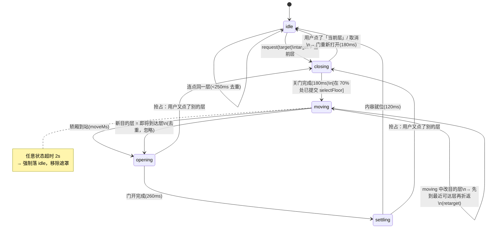

# 楼层切换「电梯」过渡动画设计（v0.1，待评审）

> 目标：点击左侧楼层胶囊切换到另一层时，视觉上像**坐电梯**——关门、井道里纵向运行、中间层掠过、到站开门、内容就位。
>
> 本文只做方案与取舍说明，**未经批准不写业务代码**。
> 结论先行：只在左栏（`FloorSelector` 的井道）加一个轿厢 + 在主舞台加两扇门，其它一律不动；动画编排用 CSS transition + 一个 composable 状态机，不上 Web Animations API。

---

## 0. 现状梳理（已确认的事实）

### 0.1 楼层切换的真实调用链

```
用户在左栏点胶囊
  renderer/src/components/FloorSelector.vue
    <button class="floor" @click="select(p)">      →  select(p)  emit('update:modelValue', p.id)
  ↓
  renderer/src/App.vue
    <FloorSelector :products="sessions.floors"
                   :model-value="sessions.selectedFloor"
                   @update:model-value="sessions.selectFloor($event)" />
  ↓
  renderer/src/stores/sessions.js
    selectFloor(id)                                 →  同步改三个状态，不发请求：
                                                       this.selectedFloor = id
                                                       this.selectedId    = pick?.id ?? ''
                                                       this.floorEmpty    = !this.selectedId
  ↓
  连锁反应（同步 / 异步混杂）
    · App.vue      watch(floorEmpty → projectName)  →  msgs.setSnapshot([]) 或 refreshMessages()  ← 唯一的网络请求
    · IsoOfficeView.vue  watch(sessions.selected)   →  mainAgent.applySession / project.openWorkspace(sel.projectPath)
    · IsoOfficeView.vue  watch(sceneMembers)        →  office.setMembers(v)（Canvas 重画）
    · IsoOfficeView.vue  floorLabel computed         →  左上角「3F · xxx」标签
```

关键点三条：

1. **切楼层本身是纯同步的**。`selectFloor` 不发请求，楼层/会话数据早就躺在 store 里（`/api/v1/sessions` 10s 轮询 + WS `SESSIONS` 推送）。所以「电梯要不要等数据」这个担忧，对**办公室画面**不成立——它下一帧就能画出来。
2. **唯一有延迟的是对话记录**：`App.vue` 的 `refreshMessages()` 会 `fetch('/api/v1/snapshot')`。本地 HTTP 通常 <50ms，但服务端忙 / 首次冷启动可能几百 ms。
3. **切换是「换脸」而不是「换页」**：`App.vue` 的 `<section class="stage">` 里 `v-if/v-else-if` 按 `tab` 切视图，但切**楼层**不切视图——同一个 `IsoOfficeView` 实例原地换数据。所以没有路由过渡、没有组件卸载/挂载，天然没有动画。

### 0.2 主视图切换时有没有 loading / 骨架屏

**没有。** 全仓 grep `loading|骨架|skeleton` 无命中。空态只有文案兜底（`<p v-if="!members.length" class="empty dim">暂无成员数据</p>` 这类）。切楼层时：

- 有会话 → Canvas 里的人直接被 `office.setMembers()` 换掉，一帧突变；
- 空楼层 → 人全没了，屋里空着，主控制台显示「本层暂无活跃会话」。

也就是说现在是**硬切**：上一帧是 2F 的人，下一帧是 5F 的人。这正是要靠「门」遮住的那一下。

### 0.3 现有动效约定

- `renderer/src/styles/theme.css`（87 行）是**纯 token + reset**：只有颜色、`--radius/--gap/--mono`、几个 `.dim/.faint/.na` 工具类。**没有任何 `transition` / `animation` / `@keyframes`，也没有 `prefers-reduced-motion`**。→ 动效规范是空缺的，本次要顺手补一层 motion token。
- 动效目前散落在各组件 `<style scoped>` 里，量级都很轻：

| 位置 | 声明 | 观感 |
| --- | --- | --- |
| `FloorSelector.vue:116` | `transition: border-color .15s, transform .1s, opacity .15s, box-shadow .15s` | 胶囊 hover/选中 |
| `DeskScene.vue:186,258,455,564` | `transition: transform .35s ease, opacity .35s ease` / `.4s ease` | 工位卡片进出 |
| `ChatPanel.vue:123` | `transition: width .18s ease` | 抽屉展开 |
| `ProgressBar.vue:43` | `transition: width 240ms ease` | 进度条 |

  默认缓动基本是 `ease` / 线性，时长集中在 **150–400ms**。→ 新的电梯动画要落在这个量级里（总计 1s 上下是合理的「有仪式感但不拖沓」），曲线要写成具名 token，别再散写 `ease`。

- 视觉基调：**深色扁平 + 2.5D 等距拟物**。`IsoOfficeView` 是 `iso/engine.js` 现画的 Canvas 等距办公室（有地板、工位、小怪物精灵），配上扁平的深色 HUD。→ 电梯隐喻是**顺着这个基调做加法**，不是新开一套美术风格；但也别做成真·拟物电梯（金属拉丝、楼层指示灯带），HUD 语言要保持一致。

- 已有 rAF 循环：`iso/engine.js:1782,2043`、`OfficeSceneView.vue:264,418`、`IsoOfficeView.vue:327`。动画期间这些循环照跑，是性能预算里要算进去的（见 §6）。

---

## 1. 概念模型：楼层面板 ↔ 电梯井道

```
左栏 .rail（现有 DOM，就是井道）          主舞台 .stage（现有 DOM，就是轿厢内部看出去的视野）
┌─────────────┐                          ┌──────────────────────────────┐
│  楼  层      │  ← 井道顶                │ ▐▌                      ▐▌    │  ← 两扇门
│ ┌─────────┐ │                          │ ▐▌   IsoOfficeView      ▐▌    │
│ │  5F  ▲  │ │  ← 层站地标 + 按钮       │ ▐▌   (Canvas)           ▐▌    │
│ └─────────┘ │                          │ ▐▌                      ▐▌    │
│ ╔═════════╗ │  ← .car 轿厢（新增，      │ ▐▌                      ▐▌    │
│ ║ 4F ● 2  ║ │    绝对定位 overlay，     └──────────────────────────────┘
│ ╚═════════╝ │    translateY 移动）          门合拢 = 关门
│ ┌─────────┐ │                               门滑开 = 开门
│ │  3F     │ │
│ └─────────┘ │
└─────────────┘
```

| 现实电梯 | 本设计里的对应物 | 说明 |
| --- | --- | --- |
| 井道（shaft） | `.rail` 现有左栏容器，改 `position: relative` | 胶囊本来就是竖向堆叠的，不用改结构 |
| 层站按钮 | 现有 `.floor` 胶囊本身 | 点击即呼梯；`.selected` 就是「本层停靠」 |
| 轿厢（car） | 新增 `.car` 覆盖层，高度 = 一个胶囊高度，`transform: translateY()` 在井道里滑 | 半透明 accent 描边 + 中间一条「门缝线」 |
| 轿厢门 | 轿厢中央的门缝线：关门时两片合拢（线由暗变亮并锁一下），开门时向两侧分开消失 | 轿厢只有 140px 宽，做真门片看不清，用线暗示 |
| 主角门 | 主舞台 `.stage` 上新增 `ElevatorDoors.vue` 的两扇 `.door-l/.door-r` | 这是用户真正看得见的门，遮住内容换脸 |
| 楼层数字 | 轿厢内的「odometer」数字条：一串纵向排列的层号，`translateY` 逐格滚跳 | 与轿厢经过每层的时刻对齐 |
| 中间层掠过 | 轿厢经过某个胶囊时，该胶囊叠一层 `.pass` 伪元素，`opacity` 一闪 | 只在跨 ≥2 层时有 |

**为什么门做在主舞台而不是轿厢上**：用户 90% 的注意力在主视图，内容突变发生在那儿，需要被遮住的也是那儿。轿厢只负责回答「我现在在第几层、正在往哪儿走」——这是导航信息，不是遮挡物。两套门都要做的话复杂度翻倍、收益递减，砍掉（见 §7）。

---

## 2. 时序表（毫秒级）

一次「点击 → 内容就位」拆五段。总时长随跨越层数变化，跨 1 层约 **860ms**，跨 4 层约 **1220ms**。

| # | 段 | 相对起止 | 时长 | 缓动曲线 | 视觉动作 | 并行发生的其它动作 |
| --- | --- | --- | --- | --- | --- | --- |
| 0 | 按下反馈 | 0–60 | 60ms | `cubic-bezier(0.2,0,0.2,1)` | 目的层胶囊 `translateY(1px)` + 边框转 accent + 外发光点亮 | 呼梯登记（写 `targetFloor`）；rail 置 `aria-busy=true` |
| 1 | **closing** 关门 | 60–240 | 180ms | `cubic-bezier(0.45,0,0.55,1)`（先加速后贴合） | 两扇门 `translateX(±100%) → 0` 合拢；轿厢门缝线由暗转亮 | 关门**到 70%** 时（约 t=185ms）才真正调 `sessions.selectFloor(target)`——换脸发生在门后，用户看不见突变 |
| 1b | 门锁扣 | 240–280 | 40ms | `linear` | 门缝线一次亮度脉冲（opacity .4→1→.5），像门锁咔哒 | — |
| 2 | **moving** 井道运行 | 280–(280+move) | `moveMs` | `cubic-bezier(0.52,0,0.28,1)`（起步缓→匀速→尾段长距离滑行停靠，末段约 4% 过冲回弹） | 轿厢 `translateY(fromTop → toTop)`；楼层数字条同步滚跳；每经过一个中间层胶囊，该胶囊 `.pass` 伪元素 `opacity 0→.35→0`（单程 120ms，中心对齐经过时刻） | 数字滚跳与轿厢共用同一条 `transition`，靠 `translateY` 的步长一致自然对齐 |
| 3 | **opening** 开门 | (280+move) – (+260) | 260ms | `cubic-bezier(0.22,0.8,0.3,1)`（快起慢收） | 两扇门 `translateX(0 → ±100%)` 滑开；轿厢门缝线向两侧分开消失 | 开门进行到 30% 时，若数据未就绪则显示楼层骨架屏（见 §4） |
| 4 | **settling** 内容就位 | (+260) – (+120) | 120ms | `cubic-bezier(0.2,0,0.2,1)` | 舞台内容 `opacity 0→1`、`scale(.985→1)`；HUD / 楼层标签 / 主控制台依次淡入（stagger 30ms） | `aria-busy=false`；`role=status` 播报「已切换到 4F · Codex CLI」 |

**`moveMs` 公式**（跨 N = |toIndex − fromIndex| 层）：

```
moveMs = clamp(240 + 130 × N, 300, 700)
  N=1 → 300ms    总 860ms
  N=2 → 500ms    总 1060ms
  N=3 → 630ms    总 1190ms
  N=4 → 700ms(封顶) 总 1260ms
```

封顶 700ms 的理由：4 层已经是本产品的最大跨度（5 个产品/楼层），再长用户会觉得「软件卡了在做特效」。

**缓动曲线的意图说明**（不是随手挑的）：

- 关门 `cubic-bezier(0.45,0,0.55,1)`：真电梯门是电机推进 → 尾段减速贴合，不是匀速。尾段不能过冲（门撞门不好看），所以收在 1。
- 运行 `cubic-bezier(0.52,0,0.28,1)`：起步和停靠都缓、中段快，且控制点 y 让末段有一段「滑行」。`0.28,1` 这个尾部比标准 `ease-in-out` 拖得长，是「停靠」的手感来源。
- 开门 `cubic-bezier(0.22,0.8,0.3,1)`：门一开就该迅速让出视野（前 30% 走完 70% 行程），剩下慢慢收尾，避免「门还在动、眼睛已经在找内容」的拖拽感。

---

## 3. 与数据加载的配合

### 3.1 结论：**先开门 + 骨架屏，绝不等数据**

门开的时间点由动画时钟决定，与网络无关。理由三条：

1. **办公室画面根本不需要等**（§0.1）：`sessions.selectFloor` 是同步的，成员数据已在 store，Canvas 下一帧就能画。等数据纯属白等。
2. **唯一会等的只有对话记录**（`/api/v1/snapshot`），而它不在门后的主视野里——它在右侧抽屉/对话页。为了它把整扇门关着，是为一个配角让主角罚站。
3. **门关着不动 = 用户判定为卡死**。门开 + 骨架屏至少传达了「我在动、我在加载」，这是可预期的；门闭着不动是不可预期的。

### 3.2 骨架屏怎么放、什么时候出现

- 骨架屏**不是新设计一套**：复用「空楼层」已有的视觉——等距地板网格 + 若干灰色工位占位（`iso/engine` 画空场的能力已经存在，或最简版：主舞台上盖一层 CSS 灰度块，8 个 `border-radius: 10px` 的 `--bg-panel` 方块按工位位置摆，配 1.2s 的 opacity 呼吸）。**先做 CSS 版**，成本 ~20 行；要不要升级成 Canvas 空场渲染，看第一版观感再定。
- **避免闪烁**：骨架屏有 **180ms 最小显示延迟**（`minVisible`）——数据 180ms 内到达就压根不显示。本地 HTTP <50ms 的情况下，用户 99% 的时间看不到骨架屏，它只是个兜底。
- 数据到达后：骨架屏 `opacity → 0`（120ms）与真实内容 `opacity → 1` 交叉，不直接硬替换。

### 3.3 超时与失败降级

| 情况 | 处理 |
| --- | --- |
| `refreshMessages` 超过 **1500ms** 未返回 | `AbortController.abort()`，动画照常走完（此时门已开），对话区显示「对话加载中…」，后续 WS `SNAPSHOT` 到达自动补上（现有代码已有这个兜底语义：`/* 忽略：WS 重连后会重新推 snapshot */`） |
| 请求抛错 / 服务端不可达 | 同上，对话区显示失败态 + 重试按钮。**动画不受任何影响** |
| 动画自身卡住（回调没触发、`transitionend` 丢失） | 状态机每段挂一个 **2s 兜底 timeout**，超时强制推进到下一态；`opening` 超时直接落 `idle` + 移除所有遮罩。原则是：**任何异常都不能把门永久关上** |
| 动画期间收到 10s 轮询 / WS `SESSIONS` 推送 | 正常更新 store，但**不得重置轿厢位置**：轿厢位置只由 `phase` 和 `targetFloor` 决定，不由 `selectedFloor` 直接决定（见 §5 的 `pendingTarget` 处理） |

---

## 4. 状态机

### 4.1 状态枚举

| 状态 | 含义 | 可视化 |
| --- | --- | --- |
| `idle` | 静止停靠在某层 | 门开（门 `translateX(±100%)`，不可见），轿厢对齐当前层，无过渡类 |
| `closing` | 关门中 | 门向中间合拢，轿厢门缝线亮 |
| `moving` | 井道运行中 | 门全闭，轿厢 `translateY` 位移，数字滚跳，中间层掠过 |
| `opening` | 开门中 | 门向两侧滑开，骨架屏按需出现 |
| `settling` | 内容就位 | 内容 fade+scale 归位，HUD stagger 淡入 |

> `settling` 与 `opening` 在观感上有重叠，但拆开是有用的：`settling` 是「可以接受新点击」的第一个时刻，用它做抢占边界比用 `opening` 更精确。

### 4.2 迁移图



### 4.3 动画中再次点击的策略

| 时机 | 用户行为 | 策略 | 理由 |
| --- | --- | --- | --- |
| `idle` | 点其它层 | 正常发起 | — |
| `idle` | 250ms 内重复点同一层 | **忽略**（去重） | 手抖 / 双击，不值得重启一套动画 |
| `closing` | 点**当前层**（反悔） | 回 `idle`，门重新打开 | 呼梯后取消，符合直觉 |
| `closing` | 点**另一个层** | **更新 `targetFloor`，不重启关门**——门继续关，关完按新目标走 | 关门是「不可撤销的进行时」，重启会闪 |
| `moving` | 点另一个层 | 记 `pendingTarget`：轿厢**至少先走完当前这一层**（到最近可达层）再重新进 `moving` 折返 | 瞬移会破坏「电梯在井道里」的错觉。真电梯也是这样：过了这层才能反向 |
| `moving` | 点**即将到达的那层** | **忽略** | 反正马上就到了，重启 = 抖动 |
| `opening` / `settling` | 点任意层 | **允许抢占**，立即转 `closing` | 门还没全开就重新关上，比排队等 380ms 干脆得多。这是唯一允许「打断」的边界 |

实现上的防串台：每次 `request()` 递增一个 `token`，每段 `await sleep()` 后 `if (token !== current) return;`。不用 `transitionend`（多段编排里它丢事件、会重复触发，是坑）。

> 实现笔记（T3，见 effort §2.5）：本表已全部落地，但**"250ms 内重复点同一层 → 忽略"没按原文实现** ——
> phase 是同步切的，第二次点击天然幂等（不需要去重），而真去做去重反而会吞掉"反悔后马上复按"的真实操作。
> 另：`moving` 折返时**还要补一次 `selectFloor`**（门全程关着），否则车到了新层、内容还停在旧层。

---

## 5. 降级与可访问性

### 5.1 三档 motion 开关

| 档位 | 行为 | 触发条件 |
| --- | --- | --- |
| `auto`（默认） | 完整动画；但系统开启「减弱动态效果」时自动降级 | `localStorage['wg.elevatorMotion']` 缺省值 |
| `off` | **零动画**：`selectFloor` 直接调用，门永不显示，轿厢不做 transition。功能 100% 可用 | 设置里手动关 / 低配机器 |
| `on` | 强制完整动画，忽略系统偏好 | 用户明确要 |

降级档（`auto` + `prefers-reduced-motion: reduce`）的具体表现：**不做关门/运行/开门**，改为内容区 60ms 的 `opacity` 淡出淡入，轿厢直接瞬移到位（transition-duration: 0）。总耗时 <100ms。

落地方式：

```css
/* theme.css 新增 —— motion token 集中在这里，别再散写 */
:root {
  --dur-door-close: 180ms;
  --dur-door-open: 260ms;
  --dur-settle: 120ms;
  --ease-door-close: cubic-bezier(0.45, 0, 0.55, 1);
  --ease-shaft-move: cubic-bezier(0.52, 0, 0.28, 1);
  --ease-door-open: cubic-bezier(0.22, 0.8, 0.3, 1);
}

@media (prefers-reduced-motion: reduce) {
  :root { --dur-door-close: 0ms; --dur-door-open: 0ms; --dur-settle: 60ms; }
}

/* 手动关：组件根上挂 data-motion="off"，用属性选择器统一清零 */
[data-motion='off'] .door-l,
[data-motion='off'] .door-r,
[data-motion='off'] .car { transition-duration: 0ms !important; }
```

用属性选择器而不是在每个组件里写 `v-if`，是为了让开关只需改**一处** `data-motion`。

### 5.2 Electron 下的性能注意点

- **只动 `transform` 和 `opacity`**。门、轿厢、数字条、掠过伪元素全部如此。禁止动画 `width / left / top / margin / box-shadow`（`box-shadow` 动画会触发重绘，选中的外发光只在 `closing` 起始一次性切换，不做逐帧动画）。
- **`will-change: transform` 只在动画期间加**，进 `idle` 立刻摘掉。常驻 `will-change` 会长期占着合成层显存，Electron 里开着一天就是几百 MB 的量级风险。
- **门的位移用 `translateX(±100%)`，不用 `width: 0`**；数字滚跳用一条纵向数字条 `translateY`，不用改 `innerHTML`（避免动画中触发 DOM 重排 + Vue 更新）。
- **中间层掠过用伪元素 `opacity`**，不碰胶囊自身的 layout 属性。
- **换数据的时机卡在门后**（closing 70% 处）。`office.setMembers()` 会让 Canvas 重画一整帧，被门挡住时用户看不到这帧的开销。
- **`iso/engine.js` 的 rAF 循环在动画期间照跑**。这是已有开销，不在本次预算内；如果实测掉帧，可选优化是 `closing` 期间给 engine 传 `paused`（engine 已有 tick 结构，加个开关约 5 行）——**先不做**，等实测数据说话。
- **轿厢位置用实测 `offsetTop`**（胶囊高度会随路径文案换行变化，不能按索引硬算），配 `ResizeObserver` 缓存；`ResizeObserver` 回调里只写缓存不触发动画重启。

### 5.3 可访问性

- 胶囊加 `aria-current="true"` 标当前层；动画期间 rail 置 `aria-busy="true"`。
- 楼层变化用隐藏的 `role="status"` 元素播报「已切换到 4F · Codex CLI，2 个活跃会话」。
- 键盘 `Tab` + `Enter` 切楼层同样触发完整动画（走同一条 `request()`，不另开路径）。
- 门是纯装饰：两个 `.door` 加 `aria-hidden="true"`，且 `pointer-events: none`（避免关门瞬间误吞点击）。

---

## 6. 关键取舍

### 6.1 为什么是「轿厢 + 门」，而不是另外两个方案

| 方案 | 优点 | 为什么否掉 |
| --- | --- | --- |
| **A. 整屏纵向滚动**（5 层办公室纵向排列，滚动过去） | 最有「物理空间感」，方向感最强 | ① 成本高一个数量级：`IsoOfficeView` 是**单实例 Canvas**（`createIsoOffice(canvas)`），做整屏滚动要么同时持有 5 份场景（显存 / 事件 / 轮询全部 ×5），要么每次重建（切一次楼重建一次场景，明显卡顿）。② 用户的注意力被整屏位移拉走，反而丢掉「我在第几层」这个锚点。③ 楼层栏（左栏）在滚动方案里变成纯列表，电梯隐喻没了。**否决** |
| **B. 淡入淡出** | 最便宜（一个 `<Transition>` 就够） | ① **没有方向感**：1F→5F 和 5F→1F 完全一样，白瞎了「楼层」这个产品隐喻。② 遮不住内容突变（交叉淡入时两层的人是重影的，看着像 bug）。③ 淡入淡出期间用户无事可做，主观等待时间反而更长。**否决** |
| **C. 轿厢 + 门** ✅ | ① 只在左栏（轻量 DOM）做位移，主舞台只加两个门 div，**完全不碰 `iso/engine.js`**。② 方向感、层数、进度三者都有，正好是「楼层」隐喻需要的全部信息。③ 内容突变被门完整遮住，观感上从「硬切」变成「换了个地方」。④ 总时长可控（0.9–1.3s），且有明确的结束信号（门开 = 好了） | 代价：左栏要变成可定位容器（轿厢绝对定位 + `offsetTop` 测量）；多一个状态机要维护。可接受 |

一句话总结：**用最低的成本买到「方向感 + 遮挡换脸」这两件事，其余的戏剧性一律不做。**

### 6.2 成本评估

| 文件 | 动作 | 大致改动量 |
| --- | --- | --- |
| `renderer/src/composables/useElevator.js` | **新增**：状态机、`request()`、`moveMs` 计算、token 防串台、motion 档位读取 | ~120 行 |
| `renderer/src/components/ElevatorDoors.vue` | **新增**：两扇门 + `slot` 包主舞台 + 骨架屏（CSS 版） | ~90 行（含 style） |
| `renderer/src/components/FloorSelector.vue` | **改**：rail 改 `position: relative`、加 `.car` 覆盖层与数字 odometer、`aria-*`、`offsetTop` 测量 | ~80 行（含 style） |
| `renderer/src/App.vue` | **改**：`<section class="stage">` 包一层 `ElevatorDoors`；`@update:model-value` 从直接调 `selectFloor` 改为 `elevator.request()`；根上挂 `data-motion` | ~15 行 |
| `renderer/src/styles/theme.css` | **改**：新增 motion token + `prefers-reduced-motion` 兜底 | ~25 行 |
| `stores/sessions.js` / `iso/engine.js` / 各 view | **不动** | 0 |

合计 **5 个文件 / 约 250–330 行**，无后端改动，`wg.elevatorMotion=off` 或摘掉 `ElevatorDoors` 即可一键回到改动前行为。

---

## 7. 实现要点

### 7.1 CSS transition vs Web Animations API

**结论：CSS transition 为主，不上 WAAPI。** 理由：

- 这套动画是**声明式的**——每段就是「从 A 态到 B 态」，没有需要逐帧计算插值的部分。WAAPI 的价值在精确编排 / 序列 / 反向播放，这里用不上。
- 时长和曲线想以 **CSS token** 形式暴露（`--dur-door-open` 等），方便调参和做 `prefers-reduced-motion` 兜底。WAAPI 要在 JS 里读 CSS 变量再喂给 `animate()`，绕一圈。
- Vue 里用 WAAPI 要手动持有 `Animation` 对象、`cancel()` / `finish()`，且「动画中途改目的层」要 cancel 重放——**cancel 时机最容易出 bug**（会出现门闪回原位）。CSS transition 天然处理中断：改 `transform` 目标值，浏览器从当前实际位置继续平滑过渡。
- 唯一「WAAPI 更合适」的场景是 `moving` 段需要**按层数动态时长**——但 CSS 用内联 `style="transition-duration: {moveMs}ms"` 就解决了，不必引入 WAAPI。

**唯一需要 JS 精确计时的地方**：中间层掠过时刻和数字滚跳对齐。做法不是 rAF 轮询，而是在进入 `moving` 时**按层数预计算一串 `setTimeout`**（第 k 层的经过时刻 ≈ `moveMs × ease⁻¹(k/N)`），误差 <16ms，视觉上无感。

### 7.2 Vue 侧怎么组织

**不用 `<Transition>`。** 它只管 enter/leave 两态，管不了「关门 → 运行 → 开门 → 就位」这种多段编排，也无法在动画中途改目的层。硬套 `<Transition>` 的结果只能做出 §6.1 的方案 B，那正是被否掉的。

**用 composable + `data-phase` 属性驱动 CSS**：

```js
// useElevator.js（模块级单例，不用 Pinia —— 这是瞬时 UI 状态，
// 进 store 会让每次动画都广播一轮订阅，不划算）
const phase = ref('idle');        // idle | closing | moving | opening | settling
const targetFloor = ref('');
let token = 0;

async function request(id) {
  if (id === currentFloor.value && phase.value === 'idle') return;   // 去重
  const my = ++token;
  targetFloor.value = id;
  if (phase.value === 'opening' || phase.value === 'settling') { /* 抢占：直接重来 */ }
  // …closing → 70% 处提交 sessions.selectFloor(id) → moving → opening → settling
  await sleep(moveMs, my); if (token !== my) return;
  // …
}
```

```html
<!-- App.vue：Vue 侧只改一个字符串，动画全在 CSS 里 —— 最少的 JS、最少的重渲染 -->
<div :data-motion="motionMode">
  <ElevatorDoors :phase="elevator.phase.value">
    <section class="stage"><!-- 现有 v-if 链不动 --></section>
  </ElevatorDoors>
</div>
```

```css
/* ElevatorDoors.vue：门的位移只写在这一处 */
.door { transform: translateX(-100%); transition: transform var(--dur-door-open) var(--ease-door-open); }
[data-phase='closing'] .door-l { transform: translateX(0); transition-duration: var(--dur-door-close); }
[data-phase='opening'] .door-l { transform: translateX(-100%); }
```

要点：

- Vue 侧**只有两个响应式变量**（`phase`、`targetFloor`）在动画期间变化，其余靠 CSS 属性选择器展开。这样一次切楼层只触发 2 次极小范围的 patch，不碰成员列表那种大对象。
- 轿厢的 `translateY` 目标值由 `targetFloor` 的 `offsetTop` 算出，写成内联 style；`transition-duration` 同样内联（`moveMs`）。
- 骨架屏用 `v-if="phase === 'opening' && !dataReady && elapsed > 180"` 控制，不在 `idle` 时占用 DOM。

---

## 8. 风险与验收标准

### 8.1 风险

| 风险 | 概率 | 影响 | 缓解 |
| --- | --- | --- | --- |
| 状态机卡在 `moving`，门永久关闭（内容不可见） | 中 | **严重**（功能不可用） | 每段 2s 兜底 timeout 强制推进；`onUnmounted` / 窗口失焦时强制落 `idle`；`wg.elevatorMotion=off` 可一键绕过 |
| 动画期间收到轮询/WS 推送导致轿厢跳位 | 中 | 中 | 轿厢位置只由 `phase` + `targetFloor` 推导，不由 `selectedFloor` 直接驱动；推送只更新数据 |
| `IsoOfficeView` Canvas 重绘与门动画抢帧，低端机掉帧 | 中 | 低 | 换数据卡在门后；真掉帧再给 engine 加 `paused`（预留，先不做） |
| 胶囊高度不等（路径文案换行）导致轿厢错位 | 高 | 中 | 用实测 `offsetTop` + `ResizeObserver` 缓存，禁止按索引硬算 |
| 「电梯」太抢戏，用户觉得慢（每次切楼 ~1s） | 中 | 中 | 跨 1 层压到 860ms；`settling` 段就接受新点击（可抢占）；先做，收集反馈再调 `moveMs` 系数 |
| 门遮住了点击（关门瞬间误吞） | 低 | 低 | `.door { pointer-events: none }` |

### 8.2 验收标准（可勾选）

- [ ] 跨 1/2/3/4 层切换总时长分别落在 860 / 1060 / 1190 / 1260 ms（±80ms），目测无卡顿；Electron 窗口缩放、拖拽时也不掉帧
- [ ] DevTools Performance 录制一次切楼层：**无 Layout（紫色）抖动**，门与轿厢只产生 Composite + Paint；动画全程无 `width/left/top` 类属性变化
- [ ] 动画结束后 `will-change` 被移除（Elements 面板确认合成层不常驻）
- [ ] 连点 5 个不同楼层：最终停在最后一次点击的层，状态机回到 `idle`，无卡死、无门不开的残留
- [ ] `moving` 中改目的层：轿厢到最近可达层后折返，**不出现瞬移**
- [ ] `closing` 中点当前层：门重新打开，内容保持原层不变
- [ ] kill 掉服务端后切楼层：动画照常走完，对话区显示加载失败 + 重试，**不白屏、门不卡住**
- [ ] 拔网线 / 服务端超时（>1500ms）：动画不受影响，后续 WS `SNAPSHOT` 到达能自动补上对话
- [ ] 动画期间 10s 轮询与 WS `SESSIONS` 到达：轿厢不跳位、内容不闪断
- [ ] 系统开启「减弱动态效果」（GNOME/KDE/Windows 均可）→ 自动降为 <100ms 淡入淡出
- [ ] 设置里手动关 `wg.elevatorMotion=off` → 零动画，切楼层功能 100% 可用
- [ ] 键盘 `Tab` + `Enter` 切楼层触发完整动画；读屏播报「已切换到 4F · Codex CLI」
- [ ] 关掉 feature flag（摘掉 `ElevatorDoors` / 改回直接调 `selectFloor`）后，行为与改动前完全一致（回归通过）
- [ ] `renderer/src/styles/theme.css` 里新增的 motion token 被所有动画引用，无散落的 `ease` 硬编码
