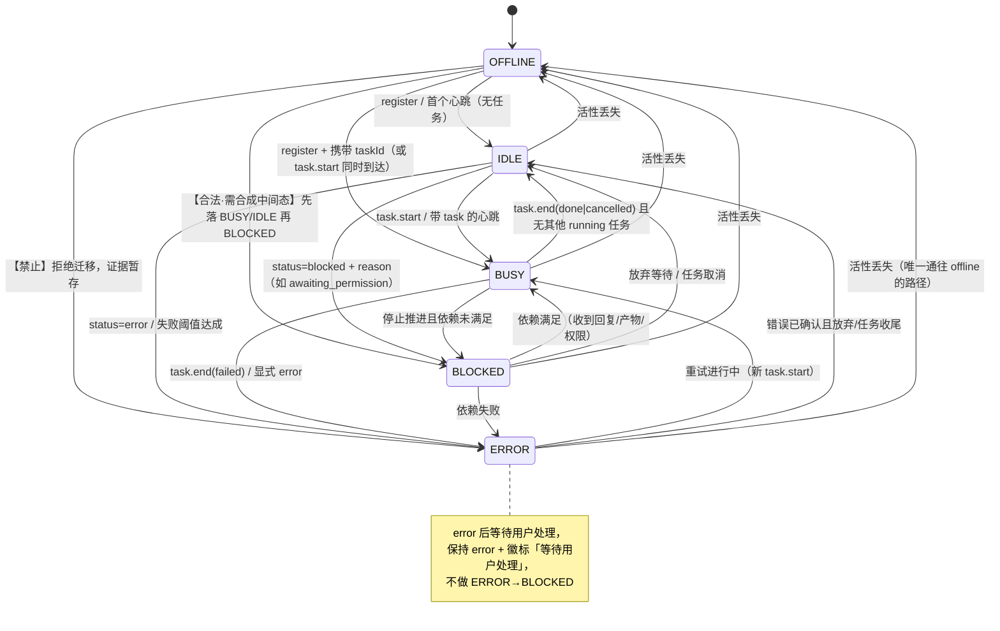

# WorkGremlin 需求规格说明书（requirements.md）

| 项 | 内容 |
| --- | --- |
| 产品名 | WorkGremlin —— 多 Agent 协作可视化桌面端（工位视图 + 对话记录） |
| 版本 | **v0.3**（并入 Q1/Q2/Q3/Q5/Q8~Q11 全部拍板结论；替代 v0.2 相关章节） |
| 编写人 | researcher（WorkGremlin 团队） |
| 关联文档 | `docs/requirements-outline.md`（大纲，编号权威来源）、`docs/roadmap.md`（排期）、`docs/tech-design.md`（coder 技术方案）、`docs/test-strategy.md`（tester 策略） |
| 工作目录 | `/home/yinghui/work/WorkGremlin` |
| 状态 | 待评审；**《§5 状态语义定义》为 M1 阻塞依赖，优先评审** |

> **编号权威**：功能编号一律沿用 `requirements-outline.md` 的 `P0-1 ~ P0-6 / P1-1 ~ P1-6 / P2-1 ~ P2-6`；开放问题一律沿用其 §6 的 `Q1 ~ Q7`（派生问题用 `Q3-1` 这类子编号）。本文档不再另立编号体系。
> 与 `tech-design.md` 的字段级差异统一登记在 **§13**，供 coder 对齐。

---

## 1. 产品定位与边界

本地单机、**只读为主**的桌面应用，把一个多 Agent 团队（leader / researcher / coder / tester …）的运行过程变成：

1. **一块看得见的工位**（Workstation View）——一眼看清谁在干、干到哪、卡在哪、卡了多久；
2. **一份查得到的对话记录**（Conversation View）——全量消息流水，可过滤、可搜索、可追溯、可导出。

| 是 | 不是 |
| --- | --- |
| 本地单机只读监控终端 | 云端 SaaS / 多人协作平台 |
| 团队运行过程的仪表盘 | agent 调度器 / 编排引擎（不替 runner 派活） |
| 对现有团队目录的「观测 + 上报接入」 | 替换 CodeBuddy 团队机制本身 |
| 面向「正在带一支 agent 团队干活的人」 | 面向 agent 本身 |

**一句话铁律：不允许编造。** 任何观测不到的字段一律显示占位（`—` / 不确定进度条），绝不用 0%、猜测值、上次旧值伪装成实时值。

---

## 2. 用户画像与场景

> **P1 是唯一设计靶心**；P2/P3 的需求只在「不增加 P1 复杂度」的前提下顺带满足。

| 画像 | 特征 | 核心诉求 | 关键场景 |
| --- | --- | --- | --- |
| **P1 主力：AI 团队操盘手**（开发者 / Tech Lead，正用 multi-agent 跑真实项目） | 同时挂 3~8 个 agent；自己也在写代码；讨厌切窗口看日志 | 「一眼看清谁在干嘛、谁卡住了，卡在哪」 | 并行开发时盯盘；某 agent 阻塞 10 分钟立刻介入 |
| P2：Agent 工程调优者（prompt / 工作流调优） | 反复跑同一批任务对比效果；关心耗时分布与消息往返 | 「复盘一次完整协作：谁等了多久、往返多少次、产出在哪」 | 跑完一轮后回看时间线，定位协作瓶颈 |
| P3：团队负责人 / 旁观者 | 不亲自下场，想知道时间花在哪 | 「不看日志也能汇报进展」 | 开会投屏工位视图；导出会话纪要 |

### 2.1 P1 的六个验收级场景

| ID | 场景 | 描述 | 成功判据 |
| --- | --- | --- | --- |
| **SC-A 挂机盯盘** | 派完活去写自己的代码，程序常驻副屏 | 3 秒内判断：几人在干、谁空闲、谁异常，**无需点击任何按钮** |
| **SC-B 长任务盯梢** | coder 在做预计 10 分钟的重构 | 知道「在动」还是「假死」；超过同类任务历史中位数 1.5 倍时卡片给出「慢于预期」角标（不改变状态色） |
| **SC-C 卡壳排查** | tester 等 coder 产物已 5 分钟无动作 | **1 次点击**定位到：阻塞成员 + 阻塞原因/依赖对象 + 卡住的起始时刻 + 该成员最近消息 |
| **SC-D 失败复盘** | 某 agent 刚才报错了 | 对话窗口按 `type=error` 过滤 + 时间轴回溯，看到完整错误链路 |
| **SC-E 冷启动接管** | 团队已跑 20 分钟后用户才打开本程序 | 打开后 ≤10s 还原各成员真实状态与最近消息（**不许空面板**，也不许用旧值冒充实时值） |
| **SC-F 演示 / E2E** | 向他人演示、或跑确定性自动化测试 | `--demo` / `MOCK=1` 产出**确定性**假数据，与真实数据视觉隔离 |

---

## 3. 范围与数据坐标系

| 维度 | 决策 |
| --- | --- |
| workspace | **单 workspace**（当前工作区）；多 workspace 仅架构预留，M0~M3 不实现 |
| team | **一等字段**：`team_id` 出现在 `members / agent_status / tasks / messages / file_activity / artifacts` 全部核心表；UI 顶部支持 team 切换（P0-4） |
| 成员规模 | 上限 **16 人**；≥5 自动切紧凑模式；>16 按 team 分页折叠（详见 §6.4） |
| 平台 | 仅 **x64**（Linux AppImage/deb、Windows nsis、macOS-x64 dmg）；不出 ARM，脚本参数化不硬编码架构 |
| 网络盘 / WSL | M0~M2 **不支持**：网络盘 / EMFILE 时降级 5s 轮询并置 `degraded`；WSL 与时钟跳变登记 M3 评估 |
| 离线演示 | `--demo` / `MOCK=1` **提前到 M0**，与 mock 静态渲染、E2E 确定性数据源三合一 |
| 反向控制 | **不做**（P2-1，待 runner 能力评估后再启动） |

---

## 4. 数据来源、融合与降级（对齐 `tech-design.md` §4）

### 4.1 两条路线

| 路线 | 内容 | 地位 |
| --- | --- | --- |
| **B（主动上报，真值）** | agent 经 `packages/reporter` SDK / CLI 上报 → HTTP ingest → SQLite → WS 推送 | **唯一真值源**。状态、进度、文件、耗时、产出均由 B 提供 |
| **A（目录监听，兜底）** | `chokidar` 监听 `{workspace}/.codebuddy/teams/{team}/`，解析 `config.json`（roster）与各成员 mailbox | **兜底**。仅能拿到名单与**收件**，拿不到发件、任务、进度、文件、耗时 |

### 4.2 融合规则（写入同一张表，`source` 区分，`dedupe_key` 去重）

1. **成员 roster**：A 发现的名单作为「已发现成员」，B 的 `register` 覆盖/补全 `role/session_id`；只被 A 发现的成员 `reported=0`，UI 打「被动观测」角标。
2. **消息**：A 侧 `source='watch'`（`dedupe_key = sha1(memberId|ts|from|sha1(content))`），B 侧 `source='report'`；同 key 只入库一次，**B 优先保留并补齐非空字段**。
3. **状态**：**B 的状态是唯一真值**；成员 60s 内无 B 心跳 → 退化为 A 推断态并置 `degraded=1`。
4. **进度 / 当前文件 / 已耗时 / 最近产出**：**仅 B 提供**；A 模式下这些区域显示 `—（未接入上报）`，**绝不推断、绝不编造**。

### 4.3 三条不可协商的约束

- **只读**：WorkGremlin **不修改**任何被观测的数据源（不回写、不标记已读进源文件）。
- **不编造**：观测不到的字段显示占位；禁止用历史值、猜测值、0% 填充。
- **幂等**：所有写入以 `dedupe_key` 唯一索引保证重放、重启、A/B 双写均不产生重复（验收见 §7.4）。

---

## 5. 状态语义定义（专章 · M1 阻塞依赖）

> **【交付状态】** 本章已单独交付 leader / coder，可作为 **M1 状态机与 DB schema 的定稿依据**。后续变更需走版本记录并在消息中同步 coder，避免 M1 实现漂移。
> **【coder 取用顺序】** §5.1 枚举 → §5.2 输入量 → §5.3 判定算法 → §5.4 逐状态定义 → §5.5 idle/busy 边界 → §5.6 blocked → §5.7 degraded → §5.8 迁移图 → §5.9 进度三值 → §5.10 展示矩阵 → §13 schema 差异清单。

### 5.1 状态模型总览

**5 个互斥主状态**：`offline` · `idle` · `busy` · `blocked` · `error`
**1 个正交标志**：`degraded`（可与任一主状态组合，如 `busy + degraded`）

```
任意时刻：每个成员有且仅有 1 个主状态 + 0/1 个 degraded 标志
主状态回答：「此刻这个工位有没有在产出，为什么没有」
degraded 回答：「这个结论的可信度是否下降」
```

> **已废弃**：`unknown` 不再作为第 6 个平级状态。无法判定时，按 §5.3 的判定链落到 `offline` 或保留旧值 + `degraded`，二者必有其一。
> **`online` 不是主状态**：接了上报但无任务的成员一律归入 `idle`（主状态已隐含在线），避免 `online/idle` 语义重叠。

### 5.2 判定输入量

**B 侧上报字段（`tech-design.md` §5.2）→ 可用于判定**

| 上报路径 | 关键字段 | 对判定提供什么 |
| --- | --- | --- |
| `/register` | `memberId, name, role, sessionId?` | 存在性、roster |
| `/heartbeat` | `memberId, state?, progress?, taskId?, files?, ts?` | **活性信号**（建议 5s 一次）+ 轻量状态 |
| `/task/start` | `memberId, taskId?, title, parentTaskId?` | 活跃任务开始 → `busy` |
| `/task/progress` | `memberId, taskId, progress, note?, files?` | 活跃任务推进（0–1） |
| `/task/end` | `memberId, taskId, state: done\|failed\|cancelled, artifacts?` | 任务结束 → `idle` / `error` |
| `/status` | `memberId, state, reason?` | 显式状态切换（`blocked` / `error` / `idle`） |
| `/message` | `from, to?, type, subject?, content, taskId?, ts?` | 消息流水；可用于识别等待语义（见 §5.6） |

**A 侧可观测证据 → 只能推断「有没有活性」**

| 证据 | 可推断 | 不可推断 |
| --- | --- | --- |
| `.codebuddy/teams/{team}/config.json` 中存在该成员 | roster 存在性 | 角色以外的一切 |
| 该成员 mailbox 文件 `mtime` 在最近窗口内有变化 | 有活动迹象 → 可推断 `busy` | 具体任务、进度、文件、耗时 |
| 该成员 mailbox 文件存在但长时间无变化 | 无活动迹象 → 可推断 `idle` | 为何无活动（不得推断 blocked/error） |

**判不了怎么办（硬规则）**：A-only 场景下 **禁止推断 `blocked` 与 `error`**（二者都需要显式语义证据，观测行为无法区分"在等依赖"与"在思考"）。推测不出来就保持上一有效主状态并置 `degraded=1`。

### 5.3 判定算法（唯一入口，伪代码）

```
输入：member, now, B_events(<=60s), A_evidence(<=300s), last_known
输出：{ state, degraded, reason, since }

// 第 0 步：时钟健康度（见 §5.7 D3）
if (时钟跳变或回退) -> degraded += CLOCK_SKEW

// 第 1 步：活性闸门（Liveness Gate）——只回答"还活着吗"
alive_by_B = (now - last_heartbeat_at <= HEARTBEAT_TIMEOUT)   // 默认 60s
alive_by_A = (存在 A 侧活动证据 && now - A_last_seen <= A_SILENT_TIMEOUT)  // 默认 300s

if (!alive_by_B && !alive_by_A) -> return OFFLINE, degraded=0
if (!alive_by_B &&  alive_by_A) -> degraded += INFERRED   // A 推断，允许继续参与仲裁
else                            -> degraded = 无（B 真值）

// 第 2 步：证据仲裁（活着的前提下，固定优先级）
//         error > busy > blocked > idle
if (存在显式 error 证据：/task/end failed  或 /status{state:'error'}
     或 ERROR_WINDOW(默认 300s) 内失败计数 >= ERROR_THRESHOLD(默认 3))
        -> ERROR
else if (存在活跃任务 running：/task/start 未 end，或 /heartbeat 携带 taskId，
     或 显式 /status{state:'busy'})
        -> BUSY
else if (存在阻塞证据：显式 /status{state:'blocked', reason}
     或 已发出请求类消息且 over BLOCK_GRACE(默认 45s) 无本地推进 且 依赖未满足)
        -> BLOCKED
else if (有活性信号，无活跃任务，无失败，无未满足依赖)
        -> IDLE

// 第 3 步：offline 兜底（第 1 步已覆盖，此处仅处理从 roster 中消失）
if (成员不在 roster 且从未上报) -> OFFLINE + "从未上报"
```

**阈值（建议值，写入设置面板，可覆盖）**

| 常量 | 默认 | 含义 |
| --- | --- | --- |
| `HEARTBEAT_INTERVAL` | **15s**（**上报侧约定，非 App 设置项**） | agent/reporter 侧参数；服务端只校验 `interval ≤ HEARTBEAT_TIMEOUT/3`（=20s）。**以本文为准，`tech-design.md` §5.2 的 5s 作废**（见 §13-11）；tester 用例按 15s 编写，**无需配置覆盖用例** |
| `HEARTBEAT_TIMEOUT` | **60s** | 超期无 B 心跳 → 置 `degraded`（拍板值，不讨论） |
| `A_SILENT_TIMEOUT` | 300s | A-only 下无活动迹象多久 → `offline` |
| `BLOCK_GRACE` | 45s | 发出请求后多久无推进 → 判 `blocked` |
| `ERROR_WINDOW` / `ERROR_THRESHOLD` | 300s / 3 次 | 失败计数窗口与阈值 |
| `CLOCK_SKEW_TOL` | 5s | 上报 `ts` 与服务端接收时刻的允许偏差 |
| `SLOW_FACTOR` | 1.5× | 超过同类任务历史中位数 1.5 倍 → 「慢于预期」角标 |

### 5.4 五主状态逐一定义

#### `offline` —— 离线
- **判定**：既无 B 心跳（>60s）又无 A 活动证据（>300s）；或成员已从 roster 移除 / 显式 deregister / shutdown 事件。
- **进入**：上述任意一条成立即刻进入。
- **退出**：任意 B 上报到达，或 A 侧出现新活动证据。
- **仅 A 可用时**：可判定（无 A 活动超 300s 即 offline）。
- **数据缺失展示**：`—`，文案 `离线 · 最后活跃 {相对时间}`；从未上报者 `离线 · 从未上报`。
- **展示**：主色 `#6B7280` 灰 · 图标 `•` · 整卡不透明度 60% · 进度条冻结为灰化 `—`。

#### `idle` —— 空闲（在线但无任务在执行）
- **判定**：有活性信号，且**无活跃 running 任务**、无未恢复失败、无未满足依赖。
- **进入**：`/task/end` 成功后；或 `/register`/首个心跳且未带 task；或 `/status{state:'idle'}`。
- **退出**：出现 `running` 任务 / 显式 blocked / error / 活性丢失。
- **边界**：**`pending`（已派单但未开始）算 `idle`**，并在卡片上加辅助徽标 `待办 N 项`（详见 §5.5）。
- **仅 A 可用时**：可推断（有 roster 且无近期活动）→ `idle + degraded`。
- **展示**：`#22C55E` 绿 · `○` 空心圆 · 状态条静态 · 文案 `空闲 · 等待派单` / `空闲 · 已完成 N 项`。

#### `busy` —— 忙碌（正在执行任务）
- **判定**：存在活跃任务（`task.state='running'`），**或** heartbeat 携带 `taskId`，**或** 显式 `busy`。
- **包含**：工具调用/读写文件/生成补丁/跑测试；**以及「思考中 / 等 LLM 返回」**——只要心跳未断，一律 `busy`（详见 §5.5）。
- **进入**：`/task/start`、`/task/progress`、带 taskId 的心跳、显式 `busy`。
- **退出**：任务 `done`（→`idle`）/ `failed`（→`error`）/ 停止推进且等待依赖（→`blocked`）/ 活性丢失（→`offline`）。
- **仅 A 可用时**：可推断（有近期活动迹象）→ `busy + degraded`，但任务标题显示 `—（未接入上报）`。
- **展示**：`#3B82F6` 蓝 · `◐` 半填充（缓慢旋转）· 左侧状态条流光 · 文案 `忙碌 · {当前动作}`（动作来自 `note` / 最近 `file_activity.op+path`；无则 `忙碌`）。

#### `blocked` —— 阻塞（任务无法推进，在等外部依赖）
- **判定**：见 §5.6。**必须**有显式或强语义证据；**A-only 场景禁止推断**。
- **进入**：`/status{state:'blocked', reason}`；或发出请求类消息后超过 `BLOCK_GRACE` 仍无任何本地推进动作且依赖未满足。
- **退出（解除）**：依赖满足（收到目标回复 / 产物就绪 / 子任务完成 / 权限获批）→ `busy`；或主动放弃该等待（→`idle`）；或等待失败（→`error`）；或活性丢失（→`offline`）。
- **卡片必须显示**：`waiting_on`（等待对象）+ 已阻塞时长 `mm:ss`；原因缺失时显示 `等待 —（未上报原因）`，**不得留空、不得编造原因**。
- **展示**：`#F59E0B` 琥珀 · `⚠` · 卡片描边琥珀 + 顶部「已阻塞 mm:ss」· 进度条冻结（灰化保留最后已知值）· 文案 `阻塞 · 等待 {依赖方/依赖物}`。

#### `error` —— 出错
- **判定**：`/task/end{state:'failed'}`、`/status{state:'error'}`、或 `ERROR_WINDOW` 内失败次数 ≥ `ERROR_THRESHOLD`；进程异常退出（heartbeat 中断且进程消失可与 offline 区分时）。
- **携带字段（schema 需支持）**：`error_type`（受控词表 `tool_error / api_error / timeout / permission / resource / validation / other`）、`retryable`（`0/1/null` 未知）、`error_summary`（≤120 字符）。三者缺失时分别显示 `other` / `未知` / `原因未上报`。
- **恢复语义**：**允许 `error → busy` 直接跳转**（重试中、开始新任务），**不强制先回 idle**；也允许 `error → idle`（错误被确认且放弃/收尾）。
- **通知/聚合粒度**（配合 Q8）：按 `member + error_type` 聚合；`retryable` 只作为文案附加（`可重试` / `不可重试` / `未标注`），不参与聚合分桶。
- **注意**：`error → blocked` 为**非法迁移**（见 §5.8）。若错误后需要等待用户处理，保持 `error` 并叠加辅助徽标 `等待用户处理`，不改变主状态。
- **仅 A 可用时**：**禁止推断** → 保持 `busy/idle + degraded`，绝不自动置 `error`。
- **展示**：`#EF4444` 红 · `✕` · 卡片描边红色 + 错误摘要首行（≤60 字符，可点开）+ 失败计数徽标 `✕3` · 文案 `出错 · {错误摘要}`。

### 5.5 `idle` 与 `busy` 的边界裁定（易争议场景裁决表）

| 场景 | 裁定 | 理由 |
| --- | --- | --- |
| 任务已派单但尚未开始（`pending`） | **`idle`** + 徽标 `待办 N 项` | 主状态描述「此刻有没有在产出」；未被领取的任务不构成产出 |
| 任务 `running`，正在思考 / 等 LLM 返回（无工具调用） | **`busy`** | 心跳未断且在任务上下文中；思考就是工作的一部分 |
| 工具调用间隙（两次调用间隔 < 心跳间隔） | **`busy`** | 禁止因工具间隙闪烁；只有 `task.end` 才结束 busy |
| 长时间无工具调用但心跳正常（>5min 无边缘动作） | **`busy` + 「慢于预期」角标** | 仍在任务中，不构成 blocked（无法区分思考与等待） |
| 等待权限审批 / hook 确认 | **`blocked`**（`reason='awaiting_permission'`） | 明确在等一个外部主体的动作 |
| 等待他人回复 / 等子任务完成 | **`blocked`**（`reason='waiting_reply:<member>'` / `'waiting_task:<id>'`） | 同上 |
| 一边跑工具一边等回复 | **`busy`**，并在卡片副信息显示 `（等待 X）` 琥珀小标记 | 有产出优先；等待信息降为次要提示 |
| 心跳断了 60s 但任务未结束 | **保持 `busy` + `degraded`** | 不得降级为 idle/offline（60s 不是死亡判决），灰显并标注推断 |
| 心跳断了 >300s 且无 A 活动 | **`offline`** | 活性闸门兜底 |

> 由此确定仲裁优先级常量：**`error > busy > blocked > idle`**，且活性闸门优先级最高（不活着一律 `offline`）。

### 5.6 `blocked` 的成立与解除

**成立条件（满足任一）**
1. **显式**：`/status{memberId, state:'blocked', reason}`
2. **语义推导**（仅 B 侧，需同时满足 a+b+c）：
   a. 该成员发出一条**请求类消息**（`type ∈ {question, block, review}` 或 `to` 指向具体成员的 `task_assign`）；
   b. 自该消息起超过 `BLOCK_GRACE`（45s）；
   c. 期间**无任何本地推进证据**（无 `/task/progress`、无 `file_activity`、无工具调用）。

**原因字段策略**
- `reason` **必填**：上报缺失时服务端写入 `reason='unspecified'` 并记录一条 `events`，UI 显示 `等待 —（未上报原因）`。
- `reason` 建议取值（受控词表，UI 可翻译）：`waiting_reply:<memberId>`、`waiting_artifact:<path>`、`waiting_permission`、`waiting_resource:<name>`、`awaiting_user`、`dependency_failed:<taskId>`、`other:<free text>`。
- **`waiting_on`（等待对象）是 UI 一等字段**：阻塞卡片**必须**渲染它；缺则显示 `—`。

**解除条件（满足任一）**
1. 目标成员产出回复消息（按 `reply_to` 或 `to/from` 配对判定）；
2. 等待的产物出现（`file_activity` 命中 path，或对应任务 `done`）；
3. 显式 `/status{state:'idle'|'busy'}` 或 `/task/start` / `/task/progress`；
4. 该成员任务被取消/结束；
5. 活性丢失 → `offline`。
6. **超时兜底**：阻塞超过 `BLOCK_ALERT`（默认 10min）**不改变主状态**，仅叠加「长期阻塞」角标（配合 P2-6 告警）。

**五条补充裁决**
1. **不做状态栈**：解除后由 §5.3 仲裁裁决目标，不回滚到 blocked 之前的状态（详见 §5.11 Q-T2）。
2. **嵌套 blocked**：以最近一次等待为准；每一层进 `agent_status_history` 可回溯；UI 只展示当前层的 `waiting_on`。
3. **UI 不得提供「手动解除阻塞」**：那是反向控制（P2-1）。用户只能看、导出、pin。
4. **多人互等的死锁**：本阶段只做**展示**（两个成员同时在等对方时，各自卡片显示 `等待 X`，并在对话窗口提供 `互等` 交叉标记），**不做自动干预**。
5. **A-only 场景**：只能由 B 显式判定；无 B 时**禁止推断 blocked**（§5.4），成员保持 `busy/idle + degraded`。

### 5.7 正交标志 `degraded` 的触发与恢复

`degraded` 是**数据可信度**标志，不是状态。触发一次记因一行（`events`，便于回溯）：

| ID | 触发条件 | 恢复条件 |
| --- | --- | --- |
| **D1** 心跳超时 | `now - last_heartbeat_at > 60s` 且仍有 A 活性证据或仍在 roster | 收到任意一条 B 上报（`/heartbeat` 或其他）即刻清除 |
| **D2** 来源为推断 | 该成员从未接 B 上报（`reported=0`），值全部来自 A 推断 | 首次成功 registro/上报后清除，并同时补算真实状态 |
| **D3** 时钟跳变 | `|上报 ts − 服务端接收时刻| > 5s`；或同一成员出现 `ts` 小于上一条 `ts`（回退） | 连续 2 条上报的 skew 回到容差内；回退时用 `ingested_at` 补齐排序并保留标记 60s |
| **D4** 观测通道降级 | 网络盘 / `EMFILE` / chokidar 失败 → 降级 5s 轮询 | watcher 恢复正常且完成一次全量重扫比对 |
| **D5** 数据缺陷 | 上报缺少必需字段（如任务存在但无 title / 无 taskId）导致该字段只能留空 | 后续上报补齐该字段 |

**`degraded` 期间的 UI 行为（必须一致）**
- 主状态**保持不变**（沿用最后一次有效判定），卡片整体**灰显：不透明度 55% + 虚线描边 + 右上角 `推断` 角标**；
- 「最后同步」改为显示相对时间并与正常的 conn bar 联动；
- 数值类字段（进度/任务/文件/产出）**冻结不刷新**；「已耗时」**继续走**但后缀 `*` 并在恢复后按服务端时钟校准（回拨时明确提示 `已校准：实际 mm:ss`）；
- `degraded` **不改变状态色**（避免用户把「数据不可信」误读为「成员出错」）。

### 5.8 状态迁移图与非法迁移处理



**迁移矩阵（行=from，列=to）——本矩阵为唯一权威版本，tester / coder 以此为准**

| from \ to | offline | idle | busy | blocked | error |
| --- | --- | --- | --- | --- | --- |
| **offline** | 非迁移 | ✅ | ✅ | ✅ *需合成中间态 | ❌ **禁止** |
| **idle** | ✅ | 非迁移 | ✅ | ✅ | ✅ |
| **busy** | ✅ | ✅ | 非迁移 | ✅ | ✅ |
| **blocked** | ✅ | ✅ | ✅ | 非迁移 | ✅ |
| **error** | ✅ | ✅ | ✅ | ❌ **禁止** | 非迁移 |

> 合计：**合法 18 条，非法 2 条**（`offline→error`、`error→blocked`）。

**不变式 INV-1：通往 `offline` 的路径只有两条** —— ① **心跳超时**（活性闸门，§5.3 第 1 步）；② **显式断开**（`shutdown` / `deregister`）。**任何业务事件（`task.end` / `error` / `block`）都不得直接把成员置为 `offline`**；它们只能改变状态的仲裁输入，由活性闸门裁决。

**非法迁移处理策略：拒绝（adopt tester 口径）**
1. **拒绝并保留原状态**：目标态非法时，**不迁移**，成员维持原主状态（不猜测、不静默改写）；
2. **证据不丢**：记一条 `events{kind:'state.transition.rejected', from, to, evidence_type, ts}`；metrics 计数 `state_transition_rejected_total + 1`；打 `warn` 级日志；
3. **延迟生效**：若被拒绝的证据落在 `ERROR_WINDOW` 内且该成员随后重新上线（心跳恢复），则立即按 §5.3 仲裁进入正确状态（如 `error`）——即「证据暂存，恢复后兑现」；
4. **绝不崩溃、绝不静默**：三条行为都必须可在日志/metrics 中被观察到。

**`offline → blocked`（合法但缺中间态）的合成规则**
- 该迁移在真实时序中不可能一步发生（能上报就说明已在线），因此出现时必须补写中间态：`OFFLINE → BUSY → BLOCKED`（证据携带 `taskId`）或 `OFFLINE → IDLE → BLOCKED`（无 taskId）；
- 中间态写入 `agent_status_history` 并标记 `synthetic=1`；**最终态 `state_since` 取触发事件的 `ts`**，而非中间态生成时刻，保证「已耗时」正确。

**去抖与合并（注意：不得违反 P95≤300ms）**

**去抖与合并（注意：不得违反 P95≤300ms）**
- 同一 tick（同一批 HTTP 上报）内的多次状态变化**只在 UI 推送一次**，以仲裁后的最终态为准；
- 渲染侧允许 100~200ms 的批量合并重绘，但**端到端 P95 仍须 ≤300ms**（测量口径见 §10）；
- `X → X`（同状态）**不更新 `state_since`**，仅刷新 `last_heartbeat_at` / `updated_at`。

### 5.9 进度百分比：`progress_source` 三值语义

```
progress_source = 'reported' | 'derived' | 'unknown'
```

| 层 | 来源 | 取值方式 | UI 表现 |
| --- | --- | --- | --- |
| ① **`reported`** | B 路线上报的 `task.progress`（0–1） | 直接采用，钳制 [0,1] | **实线进度条 + 数字**，如 `62%` |
| ② **`derived`** | 无上报值，且存在子任务清单：按「已完成子项 / 总子项」推导 | `round(done/total×100)`；分母为 0 时降级到 ③ | **斜纹进度条 + 数字 + 「推导」角标** |
| ③ **`unknown`** | 以上都没有 | 不产生任何数值 | **条纹动画（indeterminate）+ `—`**，无数字 |

**绝对禁止（AC 硬条款）**
1. ③ 层**绝不显示 0% 或 100%**，也不回填任何历史值；
2. 同一任务内 `reported/derived` 值**单调不减**（任务显式重置/重做除外，此时归零并记一条 `events`）；
3. 任务 `done` 时由 `task.end` 给出确定值 → 强制 `100%` 且 `progress_source='reported'`；
4. ① 与 ② 同时可得时取 ①；② 跨越多个 tick 时取较大值并保持来源标记为其**实际采用层**；
5. **`derived` 值必须可追溯**：tooltip 显示 `推导：已完成 3/5 个子任务`（列出子任务清单入口）。

### 5.9.1 三层的验收标准（每层都要能单独被 tester 打）

| ID | 层 | Given / When / Then |
| --- | --- | --- |
| **AC-PR1** | ① `reported` | Given B 上报 `task.progress=0.42`；When 渲染；Then 显示实线进度条 + `42%`，无「推导」角标；Given 随后上报 `0.37`（回退）；Then **UI 仍显示 42%**（同一任务内单调不减），并记录一条 `events{kind:'progress.regress'}` |
| **AC-PR2** | ①→`reported` 完成态 | Given `task.end{state:'done'}` 到达；Then 立即显示 `100%` 且 `progress_source='reported'`，保持 ≥1.5s |
| **AC-PR3** | ② `derived` | Given 无 `task.progress`，且该任务有子任务清单 5 项其中 3 项 done；Then 显示 `60%` + **斜纹** + `推导` 角标；hover/tooltip 展示 `推导：已完成 3/5 个子任务` 且可点开子任务清单 |
| **AC-PR4** | ② 边界 | Given 子任务清单为空或总数=0；Then **降级到 ③**，不得显示 `0%`，也不得显示 NaN/空字符串 |
| **AC-PR5** | ③ `unknown` 空态判据 | Given 既无 `task.progress` 又无可用子任务清单；Then 渲染条纹动画（indeterminate）+ 文本 `—`，且 `progress_source='unknown'`；**DOM 断言：该卡片不存在 "0%" / "100%" / 任何整数百分比文本**（这是第③层的核心判据，自动化直接断言） |
| **AC-PR6** | ③ 与任务无关时 | Given 成员处于 `idle`/`offline`（无当前任务）；Then 进度区域显示 `—` 且不显示任何进度条动画（避免"看起来在动"的误导） |
| **AC-PR7** | 来源切换 | Given 先是 `derived=60%` 后收到 `reported=0.42`；Then 显示 `60%`？——**不允许**。裁决：出现更高优先级的 `reported` 后，**以 `reported` 为准显示 42%** 并移除「推导」角标（真值优先于推导，单调不减规则在跨源切换时不适用；记一条 `events`） |

### 5.10 展示速查矩阵

| 主状态 | 主色 | 图标 | 文案模板 | `degraded` 叠加 | 数据缺失时（该字段未上报） |
| --- | --- | --- | --- | --- | --- |
| `idle` | `#22C55E` | `○` | `空闲 · 等待派单` / `空闲 · 已完成 N 项` | 不透明度 55% + 虚线描边 + `推断` 角标；数值冻结；耗时带 `*` | 任务→`—`；进度→`unknown` 条纹；文件/产出→`—（未接入上报）` |
| `busy` | `#3B82F6` | `◐`（旋转） | `忙碌 · {当前动作}` | 同上 | 任务无 title→`（未命名任务）`；进度→`unknown` 条纹；文件→`—` |
| `blocked` | `#F59E0B` | `⚠` | `阻塞 · 等待 {waiting_on}`（缺则 `等待 —（未上报原因）`）+ `已阻塞 mm:ss` | 同上 | 进度→冻结灰化保留最后已知值；未知则 `unknown` 条纹 |
| `error` | `#EF4444` | `✕` | `出错 · {错误摘要}` + `✕{失败数}` | 同上 | 摘要缺失→`出错 · 原因未上报`；进度→冻结最后已知值或 `—` |
| `offline` | `#6B7280` | `•` | `离线 · 最后活跃 {相对时间}` / `离线 · 从未上报` | 通常不适用（自身已是终态），若组合则以 remark 显示 | 全字段 `—` |

**辅助徽标（不参与互斥）**：`待办 N 项` · `慢于预期` · `长期阻塞` · `等待 X` · `被动观测`（`reported=0`）· `推断`（degraded）。
**无障碍**：颜色 + 图标形状 + 文案三重可区分；提供色盲模式（deuteranopia/protanopia 调色板）、高对比、减少动效三个开关（旋转/流光关闭后退回静态图标）。

---

### 5.11 裁决 FAQ（coder / tester 对齐口径）

> 针对 `test-strategy.md` §3.2.2 的四个提问，此处给出唯一答案；与本文冲突处以本文为准。

**Q-T1｜什么算 `busy`？空闲多久从 `busy` 回落 `idle`？**
- **`busy` 的充要条件**：存在 `task.state='running'` 的任务 **或** 心跳携带 `taskId` **或** 显式 `/status{state:'busy'}`。**不要求**有实际读写/输出活动（思考中、等 LLM 返回都算 busy，见 §5.5）。
- **`busy → idle` 只有一条路径：`task.end`**（`done`/`cancelled`）且无其它 running 任务。**不存在「空闲 N 秒自动回落 idle」的规则**——静默不结束任务。
- 静默期间的三种去向：**≤60s** 无心跳 → `busy + degraded`；**>60s 且有 A 活动证据** → 由 A 推断 `busy + degraded`；**>300s 且无任何活性证据** → `offline`。

**Q-T2｜`blocked` 由谁解除、解除后回到哪里？是否要状态栈？**
- **解除主体只能是证据，不是人**：见 §5.6 的 6 条解除条件（收到回复 / 产物就绪 / 权限获批 / 显式 status / 任务取消 / 活性丢失）。UI 不做「手动解除阻塞」按钮（那是反向控制，P2-1）。
- **不做状态栈**。解除后由 §5.3 仲裁重新裁决目标（通常有 running task → `busy`，否则 → `idle`），**不回滚到 blocked 之前的状态**。
- **嵌套 blocked**：以**最近一次**阻塞为准（`waiting_on` 显示最近依赖）；历史每一层都留在 `agent_status_history` 供回溯；卡片同时显示最外层等待的起始时刻（即当前 `state_since`）。

**Q-T3｜非法迁移怎么处理？**
- **拒绝**（§5.8）：保留原状态 + `events` 记录 + metrics 计数 + warn 日志 + 恢复后延迟兑现。**不是归一化、也不是接受**。

**Q-T4｜`error` 的语义与恢复？**
- 携带 `error_type`（受控词表）+ `retryable`（`0/1/null`）+ `error_summary`（≤120 字符）。
- **允许 `error → busy` 直接跳转**（重试/新任务），**允许 `error → idle`**（放弃），**禁止 `error → blocked`**（改挂徽标「等待用户处理」）。
- 通知聚合粒度 = `member + error_type`。

---

## 6. 工位视图（Workstation View）规格

### 6.1 卡片字段（P0-1）

| 字段 | 数据源 | 缺失表现 |
| --- | --- | --- |
| 成员名 / 角色 | roster + B `register` | 未知时显示 id，角色 `—` |
| 状态徽标 | B 上报（A 推断 + degraded） | `offline` + `从未上报` |
| 当前任务 | `task.title` | `—（未接入上报）` |
| 进度 | §5.9 三值 | `unknown` 条纹 + `—` |
| 当前文件 | `file_activity`（最近 N=3） | `—（未接入上报）` |
| 最近产出 | `artifacts` top3 | `—（未接入上报）` |
| 已耗时 | `state_since` → 前端时钟走动 | `—` |
| 数据源标记 | `source`/`degraded` | 图例常驻（右上角），hover 解释三种来源 |

### 6.2 文件活动语义（Q1 已拍板）

**取值**：`file_activity.op ∈ { read, write, edit }`（对齐 `tech-design.md` §4.7，需**新增 `edit`**）。

**三值判定口径（可验收）**

| op | 定义 | 判定依据（按优先级） | 典型触发 |
| --- | --- | --- | --- |
| `read` | 只读访问，未产生任何字节变更 | 工具语义为只读（Read / Grep / Glob / LSP findReferences 等），未触发写路径 | 读 `server/db.js` |
| `edit` | **对已存在文件的就地修改**（文件在本次操作前已存在，操作后 size 或内容变化） | 上报显式带 `op='edit'`；缺 `op` 时由服务端按「**写前该文件已存在 + 同 member 近 N 秒内有同一路径的 read**」推导 | Edit / str_replace / apply_patch 到已有文件 |
| `write` | **新建文件**，或整文件覆写/替换（文件此前不存在，或无法判断其是否已存在） | 上报显式带 `op='write'`；缺 `op` 且判定不了「该文件是否已存在」时，**一律保守归 `write`** | Write 新文件、整文件重写、无法判定的写入 |

**边界裁定（避免各执一词）**
1. **编辑 ≠ 先读后写**：一次 Edit 调用只产生 **1 条** `op='edit'` 记录，不得同时生成 read+write 两条（「先读后写」是实现细节，对用户无意义）；
2. **新建算 `write`**，不是 `edit`（用户要区分的是"改了老文件"还是"造了新文件"）；
3. **`op` 缺失时**：服务端按上表推导；推导不了 → 保守记 `write`（**不得记 read**，因为写事件的漏报比误报更严重，且 `write` 是高亮显示的强信号）；
4. **同一路径短时间重复 op** → 折叠为一条，计数 `hits+1`，展示 `最近 {op}`（避免刷屏）；
5. **删除类操作**本阶段不上报（`op` 不含 delete），如需在 M3 后评估再加。

**UI 语义**：`read` → **弱化灰**（灰色小图标 + 仅文件名 + 字重降一级）；`write` / `edit` → **高亮**（主题强调色 + 左侧竖条 + `op + 路径`）。

**仅 A 路线（目录监听）时用 iron law**：**不可判定**。原因是 A 只能看到 team 目录内的 mailbox 文件变化，**看不到成员对项目源码的读写**，且无法把文件变更归因到某个成员。因此：
- A-only 成员的「当前文件」区域固定显示 `—（未接入上报）`；
- **禁止**用「项目源码最近改动了哪些文件」去填充任何成员的当前文件（那必然是编造归因）；
- 若将来要做「workspace 级文件变更侧栏」，必须作为**独立面板**呈现且归属为「整个 workspace」，不得出现在任何成员卡片上。

**保留策略**：按 member 滚动清理最近 200 条（沿用技术方案）。

**AC-F1**：Given 上报 5 次 read（`src/a.ts`）+ 1 次 write（`src/new.ts`）；Then `src/new.ts` 那条带强调色左侧竖条且位于列表首位，`read` 条目为灰色弱化样式，顺序为「最近发生在上」。
**AC-F2**：Given 一次 Edit 操作修改已存在文件 `src/a.ts`；Then 只生成 1 条记录且 `op='edit'`（不允许出现 read+write 两条）。
**AC-F3**：Given 上报写操作但未带 `op` 且无法判定文件是否已存在；Then 落库 `op='write'`（`read` 为非法兜底值）。
**AC-F4**：Given 成员为 A-only（`reported=0`）；Then 其卡片当前文件区域显示 `—（未接入上报）`，且 DOM 中不出现任何文件路径。

### 6.3 自动刷新（禁止手动刷新按钮）

- AC：Given 成员状态变更事件被服务收到；When 计时到 300ms；Then **95% 的样本**UI 已完成徽标/进度/任务的 DOM 更新（端到端口径，含 ingest→DB→WS→渲染）。
- AC：UI 顶部常驻「最近更新 {n}s 前」；>10s 未更新显示降级提示（不改状态色）。

### 6.4 成员规模与紧凑模式（Q3 已拍板）

| 条件 | 布局 |
| --- | --- |
| ≤4 人 | 舒适模式（默认网格，全部字段可见） |
| **≥5 人** | 自动切**紧凑模式**（阈值 `compactThreshold` 可在设置覆盖，默认 5） |
| ≤16 人 | 单页全部渲染（网格自适应换行） |
| **>16 人** | **按 team 分页折叠**，每页 16 张，页脚提供分页器与「跳转到异常成员」快捷入口 |

**紧凑模式（≥5 人）信息取舍**

| 必须保留 | 折叠（hover / 右键详情 / 点击展开） |
| --- | --- |
| 成员名（缩写或首字 + tooltip 全称） | 任务描述（一句话） |
| 角色（色带或 1 字符） | `type` 消息类型等次要 meta |
| **状态点（颜色 + 图标 + degraded 虚线）** | 完整文件路径 —— 仅显示最后 1 个 + `+N` |
| **当前任务标题单行**（截断 ≤28 字符 + tooltip 全文） | 最近产出列表 —— 仅显示 1 条 + `+N` |
| **进度**（改为卡片底部 3px mini bar；`unknown` 仍为条纹） | 已耗时 —— 缩为 `2m` 紧凑格式，hover 显示精确值 |
| **已耗时（紧凑格式）** | 数据源图例 —— 收进 hover |
| **阻塞时必须额外显示 `waiting_on`**（紧凑模式唯一允许占第二行的信息） | — |

**排序规则（任何模式）**：`error > blocked > busy > idle > offline`，同级按 `state_since` 升序（卡最久的在前）。**保证异常成员永远在首屏**，这是 P1 用户最需要的。

### 6.5 工位视图验收清单

| ID | AC |
| --- | --- |
| AC-W1 | Given 16 个成员并发上报且字段同名；When 渲染；Then 每个 `data-testid=card-{memberId}` 的值与其成员一一对应，**无任何串台**（自动化逐字段比对） |
| AC-W2 | Given 某成员 60s 无心跳；Then 卡片置 `degraded`：不透明度 55% + 虚线 + `推断` 角标，**且主状态色不变** |
| AC-W3 | Given 无 any B 上报（仅 A）；Then 任务/进度/文件/产出/耗时全部为 `—` 或 `unknown`，**不出现任何数字型猜测值** |
| AC-W4 | Given `task.progress` 缺失且有子任务清单 3/5；Then 显示 `60%` + 斜纹 + `推导` 角标，tooltip 列出子任务 |
| AC-W5 | Given `task.progress` 缺失且无子任务清单；Then 显示条纹动画 + `—`，**DOM 中不存在 "0%" 或 "100%" 文本** |
| AC-W6 | Given 5 个成员；Then 自动进入紧凑模式，每张卡仍可读到「名字 / 状态 / 任务 / 进度 / 耗时」 |
| AC-W7 | Given 成员为 `blocked`；Then 卡片必须渲染 `waiting_on`，缺失时渲染 `等待 —（未上报原因）` |

---

## 7. 对话记录（Conversation View）规格

### 7.1 消息字段（对齐 `tech-design.md` §4.6，差异见 §13）

| 字段 | 类型 | 必填 | 说明 |
| --- | --- | --- | --- |
| `id` | INTEGER PK AUTOINCREMENT | ✅ | 单调游标，虚拟滚动与 `beforeId` 分页依据 |
| `dedupe_key` | TEXT UNIQUE | ✅ | `report` 侧由上报方提供或服务端生成；`watch` 侧 `sha1(memberId|ts|from|sha1(content))` |
| `team_id` | TEXT | ✅ | 一等字段 |
| `ts_ms` | INTEGER | ✅ | 事件发生时间（上报方时钟） |
| `ingested_at_ms` | INTEGER | ✅ | 服务端接收时间（判 skew、回填排序）— **新增** |
| `from_member` | TEXT | ✅ | 成员 id 或 `system` / `user` |
| `to_member` | TEXT | — | NULL = 广播 |
| `type` | TEXT | ✅ | 枚举见 §7.2 |
| `subject` | TEXT | — | send_message 的 summary，列表折叠态主文本 |
| `content` | TEXT | — | 正文（**已脱敏**，见 §8） |
| `task_id` | TEXT | — | 关联任务 |
| `reply_to` | INTEGER FK messages.id | — | 消息链 — **新增** |
| `source` | TEXT | ✅ | `report` / `watch` |
| `redacted` | INTEGER DEFAULT 0 | ✅ | 是否命脱敏 — **新增** |
| `redaction_version` | INTEGER | — | 脱敏规则版本，便于规则升级后重扫 — **新增** |
| `content_truncated` | INTEGER DEFAULT 0 | ✅ | 正文是否超长被折叠显示 — **新增** |
| `raw_json` | TEXT | — | **脱敏后**的原始负载（原文不入库，见 §8） |

**索引沿用技术方案**：`idx_messages_team_ts(team_id, ts_ms DESC, id DESC)`、`idx_messages_from/to/type`、FTS5（`content, subject`，M2）。
**展示排序**：`(ts_ms ASC, id ASC)`；当时钟跳变导致 `ts_ms` 回退时，按 `D3` 规则改用 `ingested_at_ms` 补排并在相应消息行标注 `时间异常`。

### 7.2 消息类型枚举（对齐 coder，需新增 `review` / `error`）

| type | 语义 | UI 标签 / 颜色 | 是否进入流水 | 默认可见 |
| --- | --- | --- | --- | --- |
| `task_assign` | 派单 / 下达任务 | `派单` 蓝 | ✅ | ✅ |
| `task_update` | 进度更新（含部分产出） | `进度` 浅蓝 | ✅ | ✅ |
| `result` | 交付结果 / 产出完成 | `产出` 绿 | ✅ | ✅ |
| `question` | 提问 / 请求信息 | `提问` 紫 | ✅ | ✅ |
| `review` | 评审 / 反馈意见 | `评审` 青 —— **新增** | ✅ | ✅ |
| `block` | 声明阻塞 / 依赖未满足 | `阻塞` 琥珀 | ✅ | ✅ |
| `error` | 错误 / 失败 —— **新增** | `错误` 红 | ✅ | ✅ |
| `shutdown` | 成员停止 / 退出信号 | `停止` 灰 | ✅ | ✅ |
| `system` | 系统 / 工具 / 环境消息 | `系统` 灰 | ✅ | ❌（可一键显示） |
| `heartbeat` | 保活心跳 | — | ❌ **不入流水**（仅更新 `last_heartbeat_at`） | ❌ |

**AC-T1**：Given 上报 `type=heartbeat`；Then `messages` 表不产生该行，且 `agent_status.last_heartbeat_at` 被刷新。

### 7.3 「不丢不重」的可验收判定

| ID | AC |
| --- | --- |
| **AC-M1 幂等** | Given 同一批 1000 条消息被重复投递 2 次（含 A/B 双写同 key）；Then `SELECT COUNT(*), COUNT(DISTINCT dedupe_key) FROM messages WHERE team_id=?` 两者相等且 =1000 |
| **AC-M2 A/B 融合** | Given 同一条消息先由 A 入库（`source='watch'`）后由 B 上报（`source='report'`）；Then 只保留 1 行，`source='report'`，且其非空字段补齐到该行 |
| **AC-M3 崩溃恢复** | Given 进程被 `kill -9`；When 重启并重新 tail 同一批文件；Then 无重复行（AC-M1 成立），丢失窗口 ≤1s（缺失部分以最后一次 checkpoint 为准补拉） |
| **AC-M4 文件轮转** | Given 被监听文件 size 小于上次 offset（truncate/rotate）；Then 触发全量重扫，依赖 `dedupe_key` 不产生重复，并写一条 `events` |
| **AC-M5 有序** | Given 任意 10 万条数据；Then UI 展示顺序严格 `(ts_ms, id)` 升序，无跳跃错位 |
| **AC-M6 乱序容错** | Given 上报 `seq` 乱序到达；Then 落库顺序按 `ingested_at`，展示按 `ts_ms` 重排，记一条 `events{kind:'out_of_order'}` |

### 7.4 过滤语义（边界必须严格）

**成员过滤**
- 多选为 **OR**（`sender ∈ Sel OR recipient ∈ Sel`），语义为「**涉及**这些成员的消息」；
- 额外提供方向三态：`全部`（默认） / `仅发出（Sel→*）` / `仅接收（*→Sel）`；
- 广播消息（`to_member IS NULL`）在「涉及」语义下 **只要 sender 命中即计入**，并提供开关 `包含广播`（默认开）。

**时间范围**
- 采用**闭区间 `[start, end]`**（含端点），毫秒精度：今日 = `[00:00:00.000, 23:59:59.999]`；
- 相对预设（`最近15分钟` / `最近1小时` / `今天` / `全部`）在**打开时刻求值后固定**，不随时间滚动（避免"边看边变"）；提供「刷新区间」按钮重新求值；
- 时间过滤基于 **`ts_ms`**（非 `ingested_at`）；仅当时钟异常标记存在时回退到 `ingested_at`。

**消息类型**
- 多选 **OR**；`system` 与 `heartbeat` 默认排除（heartbeat 恒不入库），UI 提供 `显示系统消息` 开关。

**维度之间一律 AND**（成员 AND 类型 AND 时间 AND 关键字）。

### 7.5 搜索语义

| 项 | 规则 |
| --- | --- |
| 大小写 | **不区分**（FTS5 使用 `case_sensitive 0`；降级 LIKE 时用 `LOWER()` 比较） |
| 作用域 | `content` + `subject` + 任务标题（join `tasks.title`）+ 文件路径（join `file_activity.path`）；**不含**成员名（请用成员过滤） |
| 多词 | 空格分隔 = **AND**；`"短语"` = 精确短语匹配 |
| 最小长度 | 中文 ≥1 字；英文/数字 ≥2 字符（短词不触发查询，输入即提示） |
| 去抖 | 200ms |
| 高亮 | 命中词 `<mark>`；单条最多高亮 200 处以防卡顿；超出部分不高亮但条数仍计入 |
| 结果计数 | 显示 `x / y`：`y` = **当前基线总数**（已应用「显示系统消息」开关后的结果，即用户心智中的全量），`x` = 应用全部条件后条数 |
| 排序 | 搜索结果默认 `ts_ms DESC`（最新在上），可在结果头切换升序；切换不改变已输入的任何条件 |
| 与滚动交互 | 触发搜索时**暂停自动跟随**；清空搜索框或切回 IA 时恢复 |
| 分词方案 | **FTS5 + `trigram`**（Q10 已拍板）；1~2 字查询降级 `LIKE`（详见 §7.5.1） |

**token 语法（P1）**：`from:<id>`、`to:<id>`、`type:<t>`、`task:<id>`、`has:file|error`、`since:-30m|ISO`、`is:redacted`。非法 token 行内提示 `未知条件：xxx`，**不静默返回空**。

### 7.5.1 短词（1~2 字）降级语义（Q10 已拍板）

> 背景：FTS5 `trigram` 对 1~2 字查询召回差；需 `LIKE %q%` 兜底。本节给出**降级触发、排序、文案、性能护栏**四件事的统一口径，避免 coder/tester 各执一词。

#### ① 降级策略：何时走 `LIKE`

| 查询长度 | 策略 | 说明 |
| --- | --- | --- |
| **0 字**（空） | 不查询，视为无关键字 | 保留其它过滤条件 |
| **1 字** | **`LIKE %q%`**（自动触发，无需用户选择） | 结果数通常很大，走护栏 |
| **2 字** | **`LIKE %q%`**（自动触发） | 同上 |
| **≥3 字** | **FTS5 trigram**（相关度排序） | 正常路径 |
| FTS5 不可用（降级环境） | 任意长度走 `LIKE`，且搜索框常驻「降级匹配模式」角标 | **不得静默降级** |

- **自动触发，不给用户开关**：理由是绝大多数用户不理解 tokenizer；但必须给**可理解的解释 + 可选加严**（见 ③）。
- 「1 字」的统计口径：按 **Unicode 码点**计（中文 1 字 = 1），英数按**连续串**计（`abc` = 3）。

#### ② 混排排序规则（这是最容易实现错的坑）

**FTS 结果有相关度、LIKE 结果没有。两者永不混排在同一查询里**——同一个查询单元只能走一条路径，因此不存在合并排序问题。需要排序对齐的是以下两种情况：

| 情况 | 排序规则 |
| --- | --- |
| **FTS 路径（≥3 字）** | 默认 **`ts_ms DESC`**（最新在前）。提供排序切换：「**相关度**」（`bm25()` 升序） ⇄ 「**时间**」（默认）。切换是纯展示层行为，**不改变结果集成员** |
| **LIKE 路径（1~2 字）** | **仅按 `ts_ms DESC`**；因为包含关系无相关度可言，**禁止**伪造 score。UI 明示「按时间排序」 |
| 用户从 2 字补到 3 字 | 路径切换（LIKE→FTS），结果集**允许变化**（这是预期行为，见 ③），当前滚动位置重置到顶部，自动跟随暂停状态保持 |

#### ③ UI 提示文案（正式文案，直接交付前端）

| 触发条件 | 展示位置 | 文案（原样） |
| --- | --- | --- |
| 1 字查询 | 搜索框下方提示条（`data-testid=search-mode-hint`） | `「{q}」只有 1 个字，已按包含匹配（非分词），命中可能较多。输入 3 个字以上可获得按相关度排序的结果。` |
| 2 字查询 | 同上 | `「{q}」是短词，已按包含匹配，结果可能较多；继续输入可获得更精确的结果。` |
| LIKE 路径有结果 | 结果计数旁 | `已匹配 {x} 条 · 按时间排序` |
| LIKE 路径结果 ≥ `SOFT_CAP`（默认 500） | 结果计数下方 | `匹配较多，仅显示最近 {N} 条。请用更多关键字或叠加过滤条件缩小范围。` |
| FTS 不可用 | 搜索框右侧常驻角标 | `降级匹配模式` |
| 搜索与过滤同时生效 | 过滤 chip 区右侧 | `搜索 + {n} 个过滤条件同时生效` |

> **统一原则**：结果集随查询长度变化**必须被明示**，不允许用户产生「同一个词两种答案」的困惑。上述提示条一律**非阻断**（不弹窗、不拦截），且不自动消失，直到关键字长度或路径改变。

#### ④ 性能护栏（`LIKE %q%` 在 10 万条上是全表扫）

| 护栏 | 规则 |
| --- | --- |
| **必须有 `LIMIT`** | `LIMIT = max(SOFT_CAP, 已加载条数 + PAGE)`，`SOFT_CAP` 默认 **500**；分页 `LIMIT 200 OFFSET n` 加载更多 |
| **限定时间范围** | LIKE 路径强制带时间窗：优先使用用户已选的时间范围；未选则**默认最近 7 天**，并在提示条末尾追加 `（范围：最近 7 天）`；提供「扩大到全部」按钮（显式用户动作） |
| **超时兜底** | 单条查询 **>800ms 未完成 → 中止并在 UI 显示** `查询超时，已显示部分结果，请缩小范围`；同时写一条 `events{kind:'search.timeout'}`。**不得无限等待、不得卡死 UI 线程**（查询在独立协程/线程，UI 保持可交互） |
| **最短触发长度** | ≥1 字即触发（配合去抖 200ms）；**空串不触发** |
| **索引兜底** | 若 `LIKE` 目标列无可用索引，必须在 `messages(team_id, ts_ms)` 上先做分区裁剪再扫 |

#### ⑤ 空结果与超大结果集

| 场景 | 表现 |
| --- | --- |
| 命中 0 条 | 空态：`没有匹配的消息` + 二级说明 `共 {y} 条消息，当前 {n} 个条件过滤掉了全部结果` + 「清空条件」按钮。**不得显示空白面板** |
| LIKE 命中 ≥ SOFT_CAP | 见 ③；显示部分 + 「加载更多」按钮（每页 200） |
| FTS 命中 ≥ SOFT_CAP | 同样按 200/页分页；**不限缩显示总数**（计数仍显示真实 x） |

#### ⑥ AC（给 tester 直接用）

| ID | Given / When / Then |
| --- | --- |
| **AC-Q1** | Given 库内含中文 10 万条；When 输入 1 字「的」回车；Then 走 `LIKE` 路径（断言 `events`/日志中出现 `search.mode=like`），结果按 `ts_ms DESC`，且提示条文案与 §7.5.1 ③ 完全一致 |
| **AC-Q2** | Given 同上；When 追加到 3 字「的错误」；Then 路径切换为 FTS（`search.mode=fts`），**结果集允许与 2 字时不同**，滚动位置回到顶部，提示条切换为 FTS 版文案 |
| **AC-Q3** | Given LIKE 路径；Then 返回结果 ≤500 条且显示计数；点击「加载更多」每次 +200；总数与实际匹配数在允许额外一页查询后一致 |
| **AC-Q4** | Given LIKE 路径且未选时间范围；Then 实际 SQL 带最近 7 天条件，UI 明示范围；点击「扩大到全部」后重查 |
| **AC-Q5** | Given 构造使查询 >800ms 的数据量；When 搜索；Then UI 保持可交互，800ms 后显示「查询超时」文案且已显示部分结果，并写 `search.timeout` 事件 |
| **AC-Q6** | Given 搜索 0 结果；Then 空态含原因说明与「清空条件」按钮，点击后恢复全部消息并保持滚动在顶部 |
| **AC-Q7** | Given 用户在 LIKE 结果上切换排序到「相关度」；Then 按钮不可选（disabled）并 tooltip 说明 `包含匹配无相关度` |

### 7.6 滚动行为

- 默认**自动跟随**最新消息（窗口处于底部时）；
- 用户**向上滚动超过 1 屏** → 立即暂停跟随，底部浮出 `N 条新消息 ↓`；点击 → 回到底部并恢复跟随；
- `AC-S1`：Given 用户在底部持续追加消息；Then 视口始终贴底；When 用户上滚 2 屏；Then 出现计数徽标且**不再自动跳动**；When 点击徽标；Then 回到底部并恢复跟随。

### 7.7 容量、滚动与保留（Q：90 天 / 10 万条）

| 层 | 策略 |
| --- | --- |
| 渲染 | **虚拟滚动**，`messages.page` 按 `beforeId` 分页；M0 临时 `v-for` 上限 500 行（仅 mock） |
| **AC-P1 滚动性能** | Given 单 team 10 万条已入库；When 连续滚动；Then DOM 消息节点 ≤80、滚动 ≥55fps、内存增量 ≤200MB |
| **AC-P2 查询响应** | 1 万条数据下任意「过滤/搜索」组合响应 <200ms |
| 保留策略 | **90 天 或 单 team 10 万条**（先到先触发） |
| 超限处理 | **先导出 JSONL 归档 → 校验归档行数 = 待删行数 → 再删除**，任一环节失败则中止并告警（绝不先删） |
| `archived_at` | M0 预留字段与索引；归档落地 M1 |
| 背压 | 单次突发 >1000 条时批量入库 + 合并推送（节流 100ms），UI 显示 `正在追平 +N 条` |
| 单条截断 | 正文 >800 字符折叠，`content_truncated=1`，点开抽屉看全文；工具输出类默认头尾各 200 字符 + 中间省略 |

### 7.8 pin / 详情 / 导出（P1）

- **置顶**：消息可 pin 到顶部「置顶区」，可填本地备注；**pin 项豁免一切淘汰与隐藏**；导出时默认一并导出（可取消勾选）。
- **详情抽屉**：完整正文、原始（脱敏后）JSON 折叠区、`meta`（工具/耗时/token）、关联文件可点击定位。
- **导出**：范围 = **当前过滤结果**（对话框明示：条数、时间区间、生效条件）；格式 Markdown / JSONL；单次上限 50,000 条，超出提示分批；Markdown 结构：参与者 + 时间线 + 关联任务。

---

## 8. 消息脱敏规格（**Q5 = P0-7 硬要求**）

> **定性**：脱敏不是 UI 隐藏，而是**写入 SQLite 之前的不可逆处理**；**原文（含 `raw_json` 中的敏感片段）一律不入库**。未经脱敏的内容禁止进入 `content` / `subject` / `raw_json` 任何一列。
> **范围**：`messages.content`、`messages.subject`、`messages.raw_json`；将来任何承载正文的新字段默认同样适用（无需再走一次评审）。

### 8.1 规则清单（命中替换为 `***`）

命中即用 **`***`**（三个星号）替换；**不在正文中内联任何类型提示**（原因：类型串本身也会污染搜索与展示，且给用户「还能看出是什么」的错觉）。类型与命中次数记在独立字段 `redaction_hits`（JSON，如 `[{"rule":"openai_key","count":1}]`），不进入正文。

| # | 规则 | 正则要点 | 优先级 |
| --- | --- | --- | --- |
| 1 | OpenAI / 通用 `sk-` key | `sk-[A-Za-z0-9_-]{16,}` | 高 |
| 2 | AWS Access Key ID | `AKIA[0-9A-Z]{16}` | 高 |
| 3 | GitHub token | `gh[pousr]_[A-Za-z0-9]{16,}` | 高 |
| 4 | JWT | `eyJ[A-Za-z0-9_-]{10,}\.[A-Za-z0-9_-]+\.[A-Za-z0-9_-]+` | 高 |
| 5 | 私钥块 | `-----BEGIN [A-Z ]*PRIVATE KEY-----[\s\S]*?-----END [A-Z ]*PRIVATE KEY-----` | 最高（先于其它规则执行） |
| 6 | 键值泄漏 | `(password\|passwd\|pwd\|token\|secret\|api_key\|apikey\|access_key\|authorization)\s*[:=]\s*["']?\S+["']?` | 中（值部分替换，key 名保留以便排障） |
| 7 | URL 内嵌凭据 | `\w+://[^/\s:@]+:[^/\s@]+@` | 中（仅替换 `user:pass@`，保留 host） |

**执行顺序**：私钥 → key/token 类（1~4）→ URL 凭据 → 键值泄漏；同一片段被多条命中只替换一次，`redaction_hits` 记实际命中的规则列表。

### 8.2 误伤判定（可否接受的标准）

**原则：宁可误杀，不可漏放**——漏放一次密钥的代价远高于误伤一段日志。但误伤必须**可发现、可豁免、可重扫**。

| 边界 | 判定 |
| --- | --- |
| **可接受误伤** | 疑似密钥的随机串被 `***`；含 `token=`/`password=` 字样的**日志行、错误信息、测试 fixture** 被 `***`；Base64 长串被 JWT/私钥规则命中。**这些不需要人工修复**，用户应能通过豁免名单处理 |
| **不可接受误伤** | ① **整条消息被清空**（说明正则写成贪婪跨行，属于 bug，必须有防护：`content` 保留率需 ≥20%，否则跳过该规则并告警）；② **代码结构被破坏**（如把变量名改掉导致代码不可读——键值规则只替换 `=` 右侧的值，绝不替换左侧标识符）；③ 正常短词/常见词被命中（如 `token` 单词本身不得被脱敏，必须要求其后出现 `:` `=` 等分隔） |
| **发现机制** | 每条被脱敏的消息**必须**留下标记，用户无需对比就知道「这里被改过」（见 §8.4） |
| **豁免机制** | `ignored_patterns` 白名单，维度：team / member / 文件路径；豁免生效后该规则对命中片段**不替换**且 `redacted=0`（即按原文入库——需用户确认，因为这等于放弃保护） |
| **重扫** | 规则版本升级后可对全量历史重扫并更新 `redaction_version`；**注意：属于单向操作（原文不可逆），不可回滚到未脱敏状态** |

**AC-R0 保真**：Given 一条 1000 字符的日志含 1 个 `sk-`；Then 脱敏后保留 ≥980 字符，只有该 key 变为 `***`，其余文本逐字一致。

### 8.3 脱敏后的搜索语义（**直接影响 M2 搜索验收，务必对齐**）

**核心规则：搜索只在「脱敏后文本」上匹配。** 因为原文从未入库，不存在"绕过脱敏去搜原文"的可能。

| 场景 | 用户预期（UI 必须这样表达） | 验收 |
| --- | --- | --- |
| 用户搜索一段恰好是密钥的字符串 | **搜不到**，属预期行为。搜索框下方常驻说明：`搜索仅匹配已脱敏文本（敏感片段以 *** 呈现）` | **AC-RS1**：插入含 `sk-test1234567890abcdef` 的消息；搜 `test1234` → 结果 0 条且显示该说明文案 |
| 用户搜索密钥周围上下文（如 `api call failed`） | **能命中**（周边文本未被改动） | **AC-RS2**：同上消息搜 `failed` → 命中 1 条 |
| 用户搜索 `***` | 命中所有含脱敏片段的消息；本产品将其定义为合法的"找敏感消息"用法 | **AC-RS3**：搜 `***` → 命中数 = `redacted=1` 的消息数（注意 FTS trigram 对符号的处理，需保证 tokenizer 不吞 `*`） |
| 被豁免的消息 | 按原文可搜（用户知情） | **AC-RS4**：命中数一致 |

> **给 tester 的提醒**：M2 搜索用例必须以**脱敏后落库的文本**为期望值，不能用原始上报文本的期望值（这是最常见的验收分歧点）。

### 8.4 「本条已脱敏」的展示时机与计数

| 项 | 规格 |
| --- | --- |
| **展示时机** | ① 消息列表行：`redacted=1` 时行首显示小盾牌/星标徽标（**不需要展开、不需要 hover**，列表态即可见）；② 详情抽屉顶部：横幅 `本条已脱敏 · 命中 N 处`；③ 导出文件：每条消息头部标注 `[已脱敏 N 处]`，避免导出者误以为是完整记录 |
| **是否计数** | **必须计数**。`redaction_hits` 累加得到消息级 `hit_count`，UI 显示「命中 N 处」，但**不显示具体是哪条规则命中**（减少信息泄漏）。规则的精确列表仅进入 `events` 审计（本地） |
| **零命中** | `redacted=0` 的消息**不显示任何脱敏徽标**（避免全屏都是标记导致的"狼来了"） |
| **AC-R5** | Given 一条含 3 处命中的消息；Then 列表行有徽标、抽屉显示 `本条已脱敏 · 命中 3 处`、导出文本含 `[已脱敏 3 处]`；同一 team 中 `redacted=0` 的消息无徽标 |

### 8.5 「原文通道」与风险确认文案（Q9 已拍板 · 归 M3）

> Q9 结论：**默认关闭（不存原文）**；开启需显式确认风险；OS 钥匙串优先、口令派生降级；**每次会话重新授权、不记住解锁状态**；每次查看写 `events` 日志。

#### 8.5.1 默认行为（不开启时）
1. UI 中「查看原文」入口**存在但置灰**，点击后给出解释：`本产品默认不保存未脱敏的原文，因此无法还原。若需要，请在「设置 › 安全 › 原文通道」开启（需显式确认风险）。`
2. **绝不提供「假装还原」**：不得对 `***` 做任何猜测性填充或部分展示（如 `sk-***abc` 这类"半掩码"也在禁止之列，因为它会误导用户以为能猜出原文）。
3. **AC-R6**：Given 未开启原文通道；Then 「查看原文」入口不可点击（或有 `cursor:not-allowed` + 上述说明），且无任何路径可将未脱敏文本写入 DB。

#### 8.5.2 开启流程与确认交互（**可直接验收**）
开启必须走**三步确认**，缺一不可（自动化用 `data-testid` 断言三个元素均存在且全部完成才生效）：

**步骤 1｜风险告知弹窗（必须原样展示以下文案）**

> **开启「原文通道」？**
> 开启后，WorkGremlin 会在本机的加密容器中**额外保存一份未经脱敏的消息原文**，用于「查看原文」。开启后你将承担以下风险：
> 1. **密钥泄漏面扩大**：若该加密容器或你的设备被他人访问，其中的密钥、令牌、私钥将以明文形式存在。
> 2. **保护不再是单向**：关闭通道并清理后不可恢复，但在清理之前，原文始终可被读取。
> 3. **导出与备份可能带走原文**：任何包含原文通道数据的导出、备份、云同步行为，都不会再被脱敏保护。
> 适用建议：仅在你需要排查被误伤的内容、且确信本地环境安全时开启；排查完成后请立即关闭并清理。
> 说明：即使不开启，你仍然可以查看脱敏后的全部内容与关联的任务、时间和文件。

**步骤 2｜勾选两项（必须都勾）**
- ☐ `我已阅读上述风险，理解原文将以未脱敏形式保存在本机`
- ☐ `我会在排查完成后及时关闭原文通道并清理已保存的原文`

**步骤 3｜输入确认关键词（``type-to-confirm``）**
- 输入框上方：`请输入「启用原文通道」以确认`；**输入必须完全一致**（全角/半角、空格差异均判失败）；
- 输入错误时行内提示 `输入不匹配，请重试`，**不允许绕过按钮**；
- 100% 完成后「启用」按钮才可点击（`data-testid=raw-channel-enable` 的 disabled 状态由三条件共同决定）。

#### 8.5.3 开启后的运行时规则
| 项 | 规则 |
| --- | --- |
| 密钥保护 | **OS 钥匙串优先**（Keychain / Credential Manager / Secret Service）；不可用时降级**口令派生（PBKDF2/Argon2）**，口令**永不落盘、永不出网** |
| 授权生命周期 | **每次会话（App 冷启动）必须重新解锁**；**不记住解锁状态**；空闲 15 分钟自动锁定，再次查看需重新解锁 |
| 审计 | 每次「查看原文」写一条 `events{kind:'raw.view', messageId, ts, actor}`，保留 30 天；UI 提供「查看记录」列表 |
| 存储上限 | 独立容器，建议上限 ≤200MB，超限按最旧淘汰（**淘汰即不可逆删除**），不进入主库保留策略 |
| 关闭与清理 | 关闭时提供「立即清理已保存原文」，执行后 UI 明确显示 `已清理 N 条原文`；清理前需二次确认 |
| AC-R7 | Given 已开启并完成授权；When App 重启；Then 再次查看原文时**必须重新解锁**（无持久化解锁态） |
| AC-R8 | Given 完成查看 3 条原文；Then `events` 中存在 3 条 `raw.view`，且其 `messageId` 与查看对象一致 |

#### 8.5.4 「显示原文」确认弹窗（**正式文案，直接交付前端**）

**标题**：`确认要显示未脱敏的原文？`

**正文**：
> 这条消息中有 **{N} 处**内容在入库前已被替换为 ***。现在将显示**未经脱敏的原文**。
>
> 原文可能包含：API 密钥、访问令牌、私钥、带密码的连接串等凭据。
>
> 一旦显示，原文可能通过以下途径离开你的本机，且 WorkGremlin 无法追回：
> 1. **截图 / 录屏 / 投屏 / 屏幕共享**会被原样记录；
> 2. 你对原文执行**复制**、或他人使用取色/取词类工具时，会进入**剪贴板**；
> 3. 协作工具、录屏字幕、屏幕 oriented OCR 等第三方软件可能读取屏幕内容；
> 4. 若你开启了把界面内容写入**日志 / issue / 聊天**的插件或工作流，原文会被带出去。
>
> 确认后原文将以**遮罩形式**展示：默认不可见，**按住鼠标（或按空格）才明文显示**，松开即恢复遮罩。

**按钮**：`取消`（次级，默认聚焦）· `我已知风险，显示原文`（主按钮，`data-testid=raw-view-confirm`）
**脚注**：`每次查看都会记录一条本地审计日志（不含原文内容）。`

**交互要求**
- 弹窗为**模态**，符合 NF-11 `data-testid` 约定；
- 主按钮在用户勾选 `我已理解上述泄漏途径` 之前为 **disabled**（勾选 + 点击，两步）；
- 每会话首次必弹；后续规则见 §8.5.6。

#### 8.5.5 确认后的展示形态与遮罩

| 项 | 规格 |
| --- | --- |
| **形态** | **抽屉内原地展开**（不新开窗口、不脱离当前消息上下文）；原文区域替换原本显示 `***` 的位置，上方常驻橙色警示条 `原文模式 · 未脱敏` |
| **默认遮罩** | **默认遮罩**（黑条覆盖 / `filter: blur(5px)`），**明文需按住鼠标左键或按住空格键**才显示；松开立即恢复 |
| **遮罩切换** | 提供「临时固定显示」开关（默认关），开启后 60s 无操作自动回到遮罩；**该状态不跨消息、不跨会话记忆** |
| **自动重新遮罩时机**（任一触发） | ① 松开鼠标/空格；② 抽屉关闭或切到别的消息；③ 窗口失焦；④ 系统锁屏 / 休眠；⑤ 「临时固定」满 60s；⑥ 应用进入后台 5s |
| **复制行为** | 选中复制的是**遮罩后内容还是原文**必须明确：默认复制**脱敏后文本**；仅当用户显式点击「复制原文」时才复制原文，并弹 toast `原文已复制到剪贴板，{N}s 后自动清除剪贴板`（建议 30s，尽力而为，不支持则提示风险） |
| **不得做的事** | 禁止自动朗读、禁止生成原文缩略图作为缓存、禁止把原文写入 DB / 日志 / 崩溃报告 / 遥测 |

#### 8.5.6 二次确认的触发条件（**researcher 裁定**）

采用 **「会话首次 + 频次阈值 + 批量动作」三段式**（理由：既避免每次点击都拦一道导致用户直接放弃使用，也避免一次确认后无限查看造成大批量泄漏）：

| 触发场景 | 是否需要确认 |
| --- | --- |
| **每个会话首次**查看任一原文 | ✅ 必须完整确认（勾选 + 主按钮） |
| 同会话内第 2~10 条 | ❌ 无需再次确认，但每次仍是**默认遮罩**，且顶部橙色警示条常驻，每次计入审计 |
| **同会话第 11 条起** | ✅ **再次完整确认**，文案追加 `本会话你已查看 {n} 条原文，请确认是否需要继续。`（阈值 `RAW_VIEW_RECONFIRM_AT = 10`，可配置） |
| **批量导出含原文** | ✅ **必须单独确认**，且**不支持**与单条查看共用同意；文案：`即将导出 {n} 条消息的未脱敏原文到文件，文件将不受任何保护` |
| 复制原文 | ✅ 每次均需一次轻量确认（单按钮「复制原文」即可，不再复述全文风险） |
| 会话（App 冷启动）结束再进入 | ✅ 视为新会话，回到首次规则 |

> **排除项**：`raw.view` 审计、开关原文通道等操作**不计入**上述计数；只有真正让原文出现在屏幕上的行为才计数。

#### 8.5.7 取消 / 关闭后的降级表现

| 用户动作 | 表现 |
| --- | --- |
| 点 `取消` / 按 `ESC` 关闭确认弹窗 | 停留在**脱敏视图**，消息行维持 §8.4 的「本条已脱敏 · 命中 N 处」标记；**不 Toast 说教、不弹第二次**；抽屉保持打开以继续查看脱敏内容 |
| 在原文模式下按 `ESC` | **先退出原文模式（回到遮罩/脱敏视图），再按一次 ESC 才关闭抽屉**（两级 ESC，避免误关丢失上下文） |
| 查看过程中数据源断开/原文件不可得 | 显示 `原文不可得（来源不可用或已被清理）`，**不做任何猜测性还原**，并保持脱敏视图可用 |
| 原文通道被锁定（空闲 15 分钟） | 遮罩显示 `已锁定，请重新解锁后查看` + 「解锁」按钮；**不自动携带上次的解锁态** |

#### 8.5.8 审计要求（硬约束）

**每次让原文出现在屏幕上的行为**都写一条 `events`：

```
events {
  kind: 'raw.view' | 'raw.copy' | 'raw.export' | 'raw.channel.enable' | 'raw.channel.disable' | 'raw.unlock',
  ts_ms, actor(本机用户标识), team_id, message_id,
  display: 'masked_reveal' | 'temporary_pin' | 'clipboard' | 'file',
  reconfirm_seq: <该会话内第几次>,
  duration_ms         // 明文累计可见时长
}
```
- **绝对禁止**：审计日志中**不得出现原文内容、原文片段、长度以外的任何特征**（不记录 char_count 之外的哈希）；`redacted=1` 的消息与其路由信息可记。
- 审计保留 30 天，UI 提供「原文查看记录」列表（时间、消息 id、动作、可见时长），不含内容。
- **AC-R9**：Given 查看 3 条原文并复制 1 次；Then `events` 中存在 3 条 `raw.view` + 1 条 `raw.copy`，且**序列化后的 events 表内容中不含任一密钥原文**（对 DB 文件 `grep -F` 断言）。

#### 8.5.9 键盘可达性与 ESC 行为

| 要求 | 规格 |
| --- | --- |
| 可达性 | 全部控件可 Tab 到达；焦点顺序：警示条 → 遮罩原文区 → 「临时固定显示」开关 → 「复制原文」 → 「退出原文模式」 → 关闭抽屉；焦点环可见（对比度 ≥3:1） |
| 明文触发 | 键盘：**按住空格**明文，松开恢复；**不得**要求必须使用鼠标（键鼠双通道等价） |
| ESC 两级 | 见 §8.5.7：第一次退出原文模式，第二次关闭抽屉；均在 `document` 级捕获且阻止冒泡到全局路由 |
| Enter | 在确认弹窗中 Enter = 「我已知风险，显示原文」；但该按钮在未勾选期间 disabled，Enter 无效（**不得**用 Enter 绕过勾选） |
| 减少动效 | 「减少动效」开启时不使用 blur 动画，改为纯色遮罩块（无障碍，见 §5.10） |
| AC-R10 | Given 焦点在抽屉内；When 仅使用键盘（Tab / 空格 / Enter / ESC）操作；Then 可完整完成「确认 → 明文查看 → 退出 → 关闭」，无鼠标依赖 |

### 8.6 脱敏验收清单汇总

| ID | 断言 |
| --- | --- |
| AC-R1 | 含 7 类样本的消息，脱敏后库中**不含任何原串**（对 DB 文件级 `grep -F` 断言，覆盖 `content`/`subject`/`raw_json` 全部列） |
| AC-R1b | 对同一批样本，`./data/*.db` 文件中不出现任一密钥原串（**落盘级验证，不是内存级**） |
| AC-R2 | 白名单命中的片段不脱敏，且该行 `redacted=0` |
| AC-R3 | 规则升级后全量重扫可更新 `redaction_version`，且重扫是幂等的（二次重扫结果一致） |
| AC-R4 | 同一消息被多条规则命中时只替换一次，`redaction_hits` 正确记录规则列表 |
| AC-R5 | §8.4 的三处展示（列表徽标 / 抽屉「命中 N 处」/ 导出标注）均生效；`redacted=0` 的消息无徽标 |
| AC-R6~R8 | §8.5 默认行为与运行时规则 |
| AC-RS1~RS4 | §8.3 搜索语义（**直接作为 M2 搜索验收的输入**） |
| AC-R0 | §8.2 保真度：`content` 保留率 ≥20%，正常文本逐字不变 |

---

## 9. 功能清单与验收（编号沿用 outline）

### 9.1 P0

| ID | 功能 | 验收标准（Given/When/Then 或量化指标） |
| --- | --- | --- |
| **P0-1** | 工位视图 | 见 §6.5 AC-W1~W7；自动刷新，**无手动刷新按钮**；≥16 成员不串台不错位 |
| **P0-2** | 对话记录窗口 | 展示**全部**成员消息流（非单成员收件箱）；每条含 时间 / 发送方→接收方 / 类型 / 内容（可展开）；见 AC-M1~M6、AC-S1；10 万条滚动流畅（AC-P1） |
| **P0-3** | 数据接入与落盘 | A/B 双路线 + 融合规则（§4.2）；无心跳 60s → `degraded`；SQLite（better-sqlite3 + rebuild）；保留 90 天 / 10 万条，M0 预留 `archived_at` 与索引 |
| **P0-4** | 单 workspace 多 team | `team_id` 进入全部核心表；UI 支持 team 切换；切换后仅显示该 team 数据（跨 team 数据零串台，自动化断言） |
| **P0-5** | 连接与自解释 | 顶部连接条：WS 状态 / 数据源（`上报`\|`推断`\|`degraded`）/ 最近同步时间；断线指数退避重连；休眠恢复自动补齐（依赖 AC-M3） |
| **P0-6** | 离线演示 `--demo` / `MOCK=1` | 确定性假数据源（含 5 主状态 × degraded、10 种消息类型、≥1000 条消息、1 个 16 成员样例用于压测，且两次同参数启动输出完全一致）；同参数两次启动产出**完全一致**；UI 常驻 `DEMO 数据` 角标与真实数据视觉隔离 |
| **P0-7** | **消息脱敏（硬要求）** | 写库**前**正则脱敏为 `***`，**原文不入库**（含 `raw_json`）；7 类规则见 §8.1；命中行必须有呈现；详见 §8.6 的 AC-R0 ~ AC-RS4。**验收口径**：对 DB 文件做 `grep -F`，不得出现任一密钥原串 |

### 9.2 P1（M3）

| ID | 功能 | 验收标准 |
| --- | --- | --- |
| P1-1 | 桌面打包（AppImage/deb/nsis/dmg，仅 x64） | 三平台 x64 均可安装启动；脚本参数化不硬编码架构；静默安装/升级/卸载有自动化覆盖 |
| P1-2 | 团队时间线与吞吐图（ECharts） | 展示一天的任务分布、成员吞吐、消息量；10 万条数据下首屏 <2s |
| P1-3 | 会话导出 Markdown / JSONL | 导出范围 = 当前过滤结果且对话框明示；Markdown 含参与者 + 时间线 + 关联任务；5k 条 ≤3s |
| P1-4 | 归档保留策略落地 | 超限**先导出 JSONL 校验再删除**；删除前后总数可核对；失败即中止 |
| P1-5 | 暗色主题 | 跟随系统切换；满足 §5.10 对比度要求 |
| P1-6 | 只读 + 轻量动作 | 标记已读、导出、**复制（仅脱敏后文本；复制原文走 §8.5.6 的独立确认）**、pin（P1）；**不得下发任何指令**（架构与 UI 双重保证） |

### 9.3 P2（延后）

| ID | 功能 | 备注 |
| --- | --- | --- |
| P2-1 | 反向控制（派活 / 中断 / 重试） | 已拍板：本阶段不做，待 runner 能力评估；UI 不留死入口 |
| P2-2 | 多 workspace | 架构预留即可 |
| P2-3 | 崩溃回放 / 事件时间旅行 | 依赖 `events` 全量 |
| P2-4 | Tauri 迁移评估 | Electron ~100MB 暂接受 |
| P2-5 | 网络盘 / WSL 生产化 | 当前降级 5s 轮询 + `degraded`（D4） |
| P2-6 | 告警规则（阻塞超时、报错） | 依赖状态语义稳定后再做；规则见 §9.4 |

### 9.4 通知规格（Q4 / Q8 已拍板，归 P2-6，M3+）

| 项 | 规格 |
| --- | --- |
| **形态** | **仅系统通知（本地Notification），永远不做声音**、不做角标之外的打扰手段 |
| **默认状态** | **默认关闭**（`notifications.enabled=false`）；用户需在设置显式开启 |
| **免打扰** | **默认关闭**（`quietHours.enabled=false`），**不预设任何时段**；提供 `22:00–08:00` 模板一键启用（值预填但开关关） |
| **触发最小集（S1 级）** | ① 成员进入 `error`；② 成员 `blocked` 超过 **10 分钟**；③ **曾在线**成员变为 `offline` |
| **聚合规则** | `member + error_type` 为聚合键；**同成员同故障类型 5 分钟内只发 1 条**；成员离线期间不重复发送，恢复上线后合并为一条 `离线期间发生 N 次` |
| **弹出条件** | **仅当窗口失焦时**才弹系统通知（聚焦时用应用内提示条替代）；首次弹出需系统授权，用户拒绝后**不再重复申请**，改为应用内角标 |
| **点击行为** | 点击通知 → 聚焦窗口 + 定位到该成员卡片并滚动到可见区域 |
| AC-N1 | Given 通知已开启、窗口失焦、成员 X 连续触发 3 次同 `error_type`；When 5 分钟窗口内；Then 系统通知**恰好 1 条** |
| AC-N2 | Given 成员 Y 离线期间发生 5 次同故障；When 其恢复上线；Then 收到 1 条 `离线期间发生 5 次` 的合并通知，离线期间未收到任何单独通知 |
| AC-N3 | Given 窗口聚焦；When 触发 S1 事件；Then **不弹系统通知**，改为应用内提示条 |
| AC-N4 | Given 免打扰启用 `22:00–08:00`；When 23:00 触发 S1；Then 不弹窗且计入未读角标；When 09:00 触发；Then 正常弹出 |

---

## 10. 非功能需求

| ID | 需求 | 指标 / 验收 |
| --- | --- | --- |
| **NF-1** | **实时性** | 状态变更端到端（ ingest 收到 → DOM 更新）**P95 ≤ 300ms**，P99 ≤ 800ms；测量口径：服务端在 ingest 时打 `t0`，渲染层更新完成后读 `performance.now()` 回传，取差值分布 |
| **NF-2** | **16 成员不串台** | 16 成员并发同名字段注入；逐 `data-testid` 断言一一对应（SC-10 / AC-W1） |
| **NF-3** | **10 万条滚动** | DOM ≤80 节点，≥55fps，内存增量 ≤200MB；1 万条过滤/搜索 <200ms |
| NF-4 | 冷启动回填 | ≤10s 完成状态还原 + 最近 200 条/人（SC-E） |
| NF-5 | 本地优先 / 隐私 | 全本地存储；零外发请求（可核验无可疑出站）；遥测默认关闭，如需开启必须显式勾选 |
| NF-6 | 数据安全 | DB 文件权限最小化（仅当前用户）；导出行为写本地审计日志（30 天）；脱敏见 §8 |
| NF-7 | 离线可用 | 断网 + 数据源断开时仍可浏览、搜索、导出历史；降级为只读历史模式并有明确提示 |
| NF-8 | 健壮性 | 畸形输入（截断 JSON / 非 UTF-8 / 单行 ≥10MB / 非法字符 / 深层嵌套）不得崩溃，跳过并计数提示；`kill -9` 10 次后数据仍完整无半写 |
| NF-9 | 资源占用 | 空闲态 CPU ≤2%（均值）、RSS ≤300MB；满载 ≤400MB |
| NF-10 | 跨平台 | 见 §3（仅 x64）；快捷键遵循平台约定（Ctrl/Cmd） |
| NF-11 | 可测性 | 时间源可注入、`createTestApp()` 工厂、core 与 Electron 解耦（lint 强制）、关键 `data-testid`、确定性 ID —— 5 条契约（M0） |
| NF-12 | 自解释 | 首屏空态引导「未检测到数据源？点此配置路径」；状态图例 hover 可查；3 分钟内无需文档看懂工位视图 |

---

## 11. 竞品参考与取舍

| 竞品 | 观察 | **借鉴** | **明确不做** |
| --- | --- | --- | --- |
| **Claude Code Agent Monitor**（hook→HTTP→SQLite→WS；Kanban / Activity Feed / agent 状态机 / 历史导入冷启动 / 2min 兜底清扫） | 事件驱动 + WS 推送；明确状态机；**历史导入解决冷启动空面板**；定时清扫孤儿会话 | 状态机写法、冷启动回填（SC-E）、超时兜底清扫（我们的 D1/活性闸门）、导出与清理运维面板 | 面向「会话」的 5 列 Kanban（我们是常驻工位卡片）；成本/计费 |
| claude-view（Rust，"Mission Control"）、AgentMonitor（多实例管理） | 轻量本地进程；实例生命周期视角 | 「从未出现」与「曾在线后消失」要能区分（我们的 `offline` 两种文案）；紧凑态势视图调性 | 终端化表达；拉起/创建 agent（P2-1） |
| n8n（Executions 列表 + 节点输入输出钻取 + PIN 数据 + 失败重跑） | 列表过滤、逐节点输入输出、Pin 用于复现 | 消息抽屉钻取、置顶 Pin 语义、任务串联 | 编排画布 / 节点画布 |
| Node-RED（Debug 侧边栏 + Status 节点） | 节点状态色点 + **自定义状态文本**、Debug 侧边栏 | `忙碌 · {当前动作}` 的「颜色+文本」范式；高信息密度工程美学 | 流式编程 UI |
| Dify（Workflow tracing / 标注 / 逐步耗时） | 每步耗时与 token、tracing 时间线 | `meta.duration_ms`、「慢于预期」角标、P2 时间线泳道 | 云端协作与账号体系 |
| tmux（status line、activity/silence 告警） | 一行式常驻摘要、`monitor-silence` 静默告警 | 「静默超时」即我们的活性闸门 + `HEARTBEAT_TIMEOUT/A_SILENT_TIMEOUT`；P2 悬浮迷你条 | 终端内 UI |

**差异化**：把「常驻工位卡片 + 5 主状态/degraded 清晰语义 + 10 万条可追溯流水」三件事做扎实，其余（计费、编排、云端、终端 UI、反向控制）一律不做。

---

## 12. 开放问题（沿用 outline §6 / §6.1 的 Q1~Q11，派生用子编号）

| # | 问题 | 状态 | 结论 / 待拍板点 |
| --- | --- | --- | --- |
| **Q1** | 「正在读写的文件」是否要精确到读/写动作？ | **已决策** | `op ∈ {read, write, edit}`；UI：`read` 弱化灰、`write/edit` 高亮（§6.2）。需 coder 在 `file_activity` schema 增加 `edit` |
| **Q2** | 进度百分比由自报还是推导？ | **已决策** | 三层降级 `reported → derived → unknown`，UI 分别为 实线+数字 / 斜纹+数字+`推导` / 条纹动画+`—`；**禁止显示 0%/100%**（§5.9） |
| **Q3** | 成员数量上限与紧凑模式阈值？ | **已决策** | 上限 16；≥5 自动紧凑（阈值可覆盖）；>16 按 team 分页折叠（§6.4） |
| **Q3-1** | 紧凑模式下的信息取舍（保留/折叠什么） | **本文档已给出**（§6.4），待 leader/coder 确认无异议 | 必须保留：名字、角色、**状态点**、任务单行、进度 mini bar、耗时；阻塞时额外保留 `waiting_on` |
| **Q3-2** | 卡片排序是否允许用户在「异常优先」之外选「按角色固定顺序」 | **待拍板** | 建议：默认异常优先，提供设置项切回「角色固定顺序」（leader/researcher/coder/tester）以稳定空间记忆 |
| **Q4** | 是否需要声音 / 系统通知（阻塞超时、报错）？ | **已决策**（Q8 在同题下拍板） | **仅系统通知、不做声音**；默认关闭 / **免打扰默认关闭且不预设时段**，提供 `22:00–08:00` 模板一键启用；完整聚合与触发规则见 **§9.4**（归 P2-6，M3+） |
| **Q4-1** | 通知的触发最小集与聚合粒度 | **已决策**（同 §9.4） | 最小集：成员进入 `error`、`blocked` 超过 10 分钟、曾在线成员变 `offline`；聚合粒度 = `member + error_type`；仅 S1 级故障、**同成员同故障类型 5 分钟聚合 1 条**、离线期间不重复、上线合并为「离线期间发生 N 次」、**失焦才弹系统通知** |
| **Q5** | 敏感信息是否需要脱敏/加密存储？ | **已决策（升为 P0-7 硬要求）**：写库前正则脱敏为 `***`，**原文不入库** | 规格与文案：**§8**（§8.1 规则 / §8.2 误伤边界 / §8.3 搜索语义 / §8.4 展示与计数 / §8.5 原文通道 / §8.6 AC） |
| **Q5-1** | 是否要对 SQLite 文件本身做加密（at-rest）？ | **待拍板** | 建议 **不加密**（本地 trusted、加密会破坏 FTS5 与排障能力），改用文件权限 + §8 脱敏兜底；若用户坚持可在 M3 评估 SQLCipher |
| **Q6** | 是否接受 Electron ~100MB 包体？ | 已暂批（待用户最终确认） | 保持不变，M3 后再评估 Tauri（P2-4） |
| **Q7** | 反向控制做不做？ | **已决策：本阶段不做**（P2-1） | 架构预留指令通道但 UI 不留死入口 |
| **Q7-1** | 若将来做反向控制，本地强认证是否需要？ | 待拍板（可与 Q7 一并延后） | 建议届时再做（令牌 + 二次确认 + 全量审计） |
| **Q8** | 通知：免打扰默认时段与聚合规则？ | **已决策** | 落点：**§9.4**；默认关闭免打扰（理由：默认静默会让新用户误以为「没通知」），提供 `22:00–08:00` 模板一键启用 |
| **Q9** | 原文通道：是否存原文？怎么解锁？ | **已决策**（归 M3） | 默认关闭不存原文；三步确认开启；OS 钥匙串优先、口令派生降级；每次会话重新解锁；审计写 `events`。落点：**§8.5** |
| **Q10** | 中文 FTS5 分词与短词语义？ | **已决策** | FTS5 `trigram`；1~2 字自动降级 `LIKE`（限定时间范围、必有 LIMIT、800ms 超时兜底）；**FTS 与 LIKE 不混排**；UI 明示提示文案。落点：**§7.5.1** |
| **Q11** | macOS 公证怎么办？ | **已决策** | 书面豁免：ad-hoc 签名 + 四处明示未公证说明（README / 安装包命名 / 首次启动弹窗 / 关于页） |

> **未列之外的需求一律不做。** 本表之外若出现新诉求，先补进本表再排期，避免文档与实现漂移。

### 12.1 researcher 对「免打扰默认值」的意见（Q8 补充）

main 点名让 tester 出默认值建议，这里补一条**产品侧**判断，供 tester 取值时参考：
- **默认「关闭免打扰」我认同**，理由与 main 一致（默认静默会被误读为"功能坏了/没通知"）。但请 tester 在用例里覆盖「从未启用 → 之后开启模板」的迁移路径，别只测两态。
- **不建议预设任何时段**：用户作息差异极大（有人凌晨干活），预设时段会把"应该响"的场景吃掉。
- **建议 tester 默认值**：`quietHours.enabled=false`、`quietHours.start=22:00`、`quietHours.end=08:00`（**值预填但开关默认关**），`aggregateWindowSec=300`、`focusOnly=true`、`sound=false`（声音永久 false，无设置项）。

---

## 13. 与 `tech-design.md` 的差异与对齐清单（供 coder）

| # | 位置 | 现状 | 需求侧要求 | 影响面 |
| --- | --- | --- | --- | --- |
| 1 | `agent_status.state` | `online / busy / idle / blocked / offline` | 改为 **`offline / idle / busy / blocked / error`**；删除 `online`（语义并入 `idle`），**新增 `error`** | DB schema、shared 类型、UI 枚举、影子/M0 mock 数据 |
| 2 | `messages.type` | 缺 `review`、`error` | 补 **`review`**、**`error`**（完整 10 类见 §7.2） | schema 注释、过滤器选项、UI 标签映射 |
| 3 | `file_activity.op` | `read \| write` | 补 **`edit`**（§6.2） | schema、UI 渲染权重 |
| 4 | `messages` 字段 | 缺 `ingested_at_ms` / `reply_to` / `redacted` / `redaction_version` / `content_truncated` | 全部**新增**（§7.1） | schema + 迁移脚本 |
| 5 | `tasks` | 无 `progress_source`、无 `blocked_reason` | 新增 `progress_source('reported'\|'derived'\|'unknown')`、`blocked_reason`、`waiting_on`、`error_type`（受控词表，见 §5.4）、`retryable`（0/1/null） | §5.4 / §5.6 / §5.9 依赖 |
| 5b | `messages` | 无脱敏计数 | 新增 `redaction_hits`（JSON 规则+计数，见 §8.1）、`hit_count`（聚合值），**不把类型写回正文** | §8.4 展示与计数 |
| 6 | `agent_status` | `progress REAL NULL` 表示未知 | 保留 NULL 语义，并与 `tasks.progress_source` 联动（`NULL` ⇒ `unknown`） | UI 三态渲染 |
| 7 | 状态来源 | `source: report/watch/timeout` | 保留；新增 **`timeout` 与 `degraded` 的联动**：`source='timeout'` ⇒ 必须 `degraded=1`（D1） | 一致性断言 |
| 8 | `state_since` | 已有 | 需遵循 §5.8：同状态不更新；非法迁移合成中间态时 `state_since` 取触发事件 `ts` | 耗时正确性 |
| 9 | WS `member.status` | 已有 | payload 需含 `degraded`、`degraded_reasons[]`、`progress_source`、`waiting_on`、`last_heartbeat_at` | UI 渲染与 AC-W2 |
| 10 | `--demo` 假数据 | M0 骨架 | 需覆盖 5 主状态 × degraded、10 种消息类型、1000+ 条消息、含 1 个 ≥16 成员样例用于压测 | E2E 确定性（NF-11） |
| **11** | **`/heartbeat` 上报周期** | `tech-design.md` §5.2 建议 **5s**（`建议在 flush 侧……`） | **作废，以本文 §5.3 的 `HEARTBEAT_INTERVAL=15s` 为准**。理由：15s ≤ `HEARTBEAT_TIMEOUT/3`（20s），可容忍连续丢 3 包；上报频率降为 1/3，本机资源与 IO 更省。约束：上报侧只要满足 `interval ≤ HEARTBEAT_TIMEOUT/3` 即可被服务端接受，服务端**不强制**具体值 | 心跳测试用例、reporter 默认参数、demo 数据源节拍 |
| 12 | `HEARTBEAT_INTERVAL` 是否可配 | 文档未明确 | **不是本机 App 的可配项**：它是**上报侧约定**（agent/reporter 侧参数），服务端只做上界校验。`HEARTBEAT_TIMEOUT`（60s）、`A_SILENT_TIMEOUT`、`BLOCK_GRACE`、`ERROR_*`、`CLOCK_SKEW_TOL`、`SLOW_FACTOR` 才是**设置面板可覆盖项**（见 §5.3 阈值表） | **避免 tester 为 `HEARTBEAT_INTERVAL` 加配置覆盖用例** |

---

## 14. 变更记录

| 版本 | 日期 | 变更 |
| --- | --- | --- |
| v0.1 | 2026-09-14 | 初版（画像、P0/P1/P2、状态语义、消息字段、非功能、竞品、14 条开放问题） |
| **v0.2** | 2026-09-14 | 对齐 `requirements-outline.md` v0.1 与四项拍板决策：**重写**状态语义（5 主状态 + `degraded`、判定算法、优先序 `error>busy>blocked>idle`、迁移矩阵与非法迁移处理、`progress_source` 三值）、补齐 `file_activity.op`、成员规模/紧凑模式取舍、脱敏与原文查看流程、明确 A-only「禁止推断 blocked/error」、开放问题并入 Q1~Q7、新增与 `tech-design.md` 的差异清单；移除 v0.1 中与之冲突的自有编号与 `unknown` 状态 |
| **v0.3** | 2026-09-14 | 并入全部拍板结论：① **§5 状态语义定稿**（§5.3 加 `HEARTBEAT_INTERVAL=15s` 并声明 `tech-design` 5s 作废；§5.4 `error` 增 `error_type/retryable/summary` 与「不强制先回 idle」；**§5.8 迁移矩阵改为 18 合法 / 2 非法：`offline→error`、`error→blocked` 为非法并采用「拒绝 + 保留原状态 + events + metrics + warn + 恢复后延迟兑现」**，新增不变式 INV-1「→offline 只能由心跳超时或显式断开触发」，`offline→blocked` 需合成中间态；新增 **§5.11 裁决 FAQ** 回答 tester 四问：busy 充要条件与「无空闲回落、只认 task.end」、blocked 不做状态栈、`error` 语义与恢复）；② **§5.9.1** 三层进度 AC-PR1~PR7（含 main 背书的 AC-PR5 第③层 DOM 判据）；③ **§6.2** `file_activity.op` 三值判定口径（编辑≠先读后写、新建算 write、缺 op 保守归 write）+ **A-only 不可判定**的标注规则 + AC-F1~F4；④ **§7.5.1** Q10 短词搜索语义（trigram + 1/2 字自动降级 LIKE、**FTS 与 LIKE 不混排**的排序规则、正式 UI 文案、LIMIT/时间窗/800ms 超时护栏、AC-Q1~Q7）；⑤ **§8** 脱敏升为 **P0-7 硬要求**（`***` 替换、`redaction_hits` 独立记录、**原文不入库、不得半掩码**）、新增 §8.2 误伤边界、§8.3 搜索命中语义（AC-RS1~4）、§8.4 展示时机与计数、**§8.5 Q9 原文通道**（三步开启确认 + type-to-confirm、`显示原文` 弹窗正式文案（含截图/剪贴板/录屏/日志风险）、默认遮罩与 6 种重新遮罩时机、「会话首次 + 第 11 条起 + 批量导出」三段式二次确认、取消降级、两级 ESC、审计字段禁止含原文）；⑥ **§9.4** 通知规格 Q4/Q8（含 researcher 对免打扰默认值的产品意见 §12.1）；⑦ §12 补齐 Q4-1~Q11 状态与落点章节；⑧ §13 新增 5b / 11 / 12 三条对齐项 |
